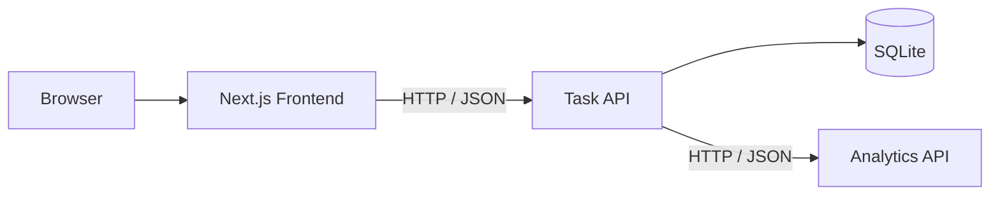

# DistributedTaskFlow

DistributedTaskFlow ist eine browserbasierte Aufgabenverwaltung mit einer kleinen verteilten Architektur.

Die Anwendung besteht aus drei getrennt gestarteten Prozessen:

- einem responsiven Next.js-Frontend
- einer ASP.NET-Core Task API
- einer separaten ASP.NET-Core Analytics API

Aufgaben werden dauerhaft in SQLite gespeichert. Die Statistikberechnung erfolgt über die separat laufende Analytics API.


---

## Überblick

### Hauptfunktionen

- Aufgaben erstellen, bearbeiten, löschen und abschließen
- Aufgaben nach Titel durchsuchen
- Aufgaben nach `All`, `Open` und `Completed` filtern
- Prioritäten und Fälligkeitsdaten verwalten
- Basic- und Weighted-Statistiken anzeigen
- Loading-, Empty- und Error-Zustände darstellen
- Aufgabenverwaltung trotz Ausfall der Analytics API weiterverwenden
- Statistikdaten nach einem Dienstausfall über `Retry` erneut laden

### Technologien

| Bereich | Technologien |
| --- | --- |
| Frontend | Next.js, React, JavaScript, JSX, CSS Modules |
| Task API | ASP.NET Core, C#, Microsoft.Data.Sqlite |
| Analytics API | ASP.NET Core, C#, Strategy Pattern |
| Datenbank | SQLite |
| Kommunikation | HTTP und JSON |
| Dokumentation | Markdown, Mermaid, Screenshots |
| Werkzeuge | Google Stitch, Cursor Agent, Codex CLI, Claude Code, Swagger UI |

---

## Systemarchitektur



Der Browser kommuniziert ausschließlich mit der Task API.

```text
Frontend      → http://localhost:3000
Task API      → http://localhost:5001
Analytics API → http://localhost:5002
```

Die Task API verwaltet die Aufgaben und die SQLite-Datenbank. Für Dashboard-Statistiken sendet sie die benötigten Daten über HTTP an die Analytics API.

Eine ausführliche Beschreibung befindet sich in der [Systemarchitektur](docs/diagrams/system-architecture.md).

---

## Projekt herunterladen

### Möglichkeit 1 – Mit Git klonen

```powershell
git clone https://github.com/mohamedderki/DistributedTaskFlow.git
cd DistributedTaskFlow
```

### Möglichkeit 2 – Als ZIP herunterladen

1. Auf GitHub `Code` auswählen.
2. `Download ZIP` auswählen.
3. Das ZIP-Archiv entpacken.
4. PowerShell im entpackten Projektordner öffnen.

---

## Voraussetzungen

Für die lokale Ausführung werden benötigt:

- .NET 10 SDK
- Node.js mit npm
- Git, falls das Repository geklont wird

Installationen prüfen:

```powershell
dotnet --version
node --version
npm --version
git --version
```

---

# Anwendung lokal starten

Für die vollständige Anwendung werden drei Terminalfenster benötigt.

## 1. Frontend vorbereiten

Im Projektstamm:

```powershell
Copy-Item frontend\.env.example frontend\.env.local
```

Die lokale Konfiguration enthält:

```env
NEXT_PUBLIC_TASK_API_URL=http://localhost:5001
```

Danach die Frontend-Abhängigkeiten installieren:

```powershell
cd frontend
npm.cmd install
cd ..
```

Die Datei `frontend/.env.local` ist nur für die lokale Ausführung vorgesehen und wird nicht in Git aufgenommen.

---

## 2. Analytics API starten

Terminal 1, im Projektstamm:

```powershell
dotnet run `
  --project backend\TaskFlow.AnalyticsApi\TaskFlow.AnalyticsApi.csproj `
  --urls "http://localhost:5002"
```

Verfügbare Adressen:

```text
http://localhost:5002
http://localhost:5002/swagger
```

---

## 3. Task API starten

Terminal 2, im Projektstamm:

```powershell
dotnet run `
  --project backend\TaskFlow.TaskApi\TaskFlow.TaskApi.csproj `
  --urls "http://localhost:5001"
```

Verfügbare Adressen:

```text
http://localhost:5001
http://localhost:5001/swagger
```

Die SQLite-Datenbank wird unter folgendem Pfad verwendet:

```text
backend/TaskFlow.TaskApi/taskflow.db
```

Falls die Datenbank oder die Tabelle noch nicht vorhanden ist, wird sie von der Task API automatisch vorbereitet.

---

## 4. Frontend starten

Terminal 3:

```powershell
cd frontend
npm.cmd run dev
```

Anwendung im Browser öffnen:

```text
http://localhost:3000
```

---

## Lokale Adressen

| Anwendung | Adresse |
| --- | --- |
| Frontend | `http://localhost:3000` |
| Task API | `http://localhost:5001` |
| Task API Swagger | `http://localhost:5001/swagger` |
| Analytics API | `http://localhost:5002` |
| Analytics API Swagger | `http://localhost:5002/swagger` |

---

## API-Übersicht

### Task API

| Methode | Endpunkt | Beschreibung |
| --- | --- | --- |
| `GET` | `/api/tasks?status=&search=` | Aufgaben laden, filtern und durchsuchen |
| `POST` | `/api/tasks` | Aufgabe erstellen |
| `PUT` | `/api/tasks/{id}` | Aufgabe bearbeiten |
| `PATCH` | `/api/tasks/{id}/toggle` | Abschlussstatus umschalten |
| `DELETE` | `/api/tasks/{id}` | Aufgabe löschen |
| `GET` | `/api/dashboard?strategy=basic` | Basic-Statistik laden |
| `GET` | `/api/dashboard?strategy=weighted` | Weighted-Statistik laden |

### Analytics API

| Methode | Endpunkt | Beschreibung |
| --- | --- | --- |
| `POST` | `/api/statistics?strategy=basic` | Basic-Statistik berechnen |
| `POST` | `/api/statistics?strategy=weighted` | Weighted-Statistik berechnen |

Die Analytics API wird ausschließlich von der Task API aufgerufen.

---

# Entwicklungsdokumentation

Die vollständige Entstehung des Projekts ist in einzelnen Schritten dokumentiert. Jeder Schritt enthält den verwendeten Prompt, die zugehörigen Dateien, Screenshots, Prüfungen und das Ergebnis.

| Schritt | Inhalt | Dokumentation | Prompt |
| --- | --- | --- | --- |
| 01 | UI-Design mit Google Stitch | [Schritt 01](docs/steps/01-google-stitch-design.md) | [Prompt 01](docs/prompts/01-google-stitch.md) |
| 02 | Projektplanung und Architektur | [Schritt 02](docs/steps/02-project-planning.md) | [Prompt 02](docs/prompts/02-project-planning.md) |
| 03 | Backend-Solution-Struktur | [Schritt 03](docs/steps/03-backend-solution-structure.md) | [Prompt 03](docs/prompts/03-backend-solution-structure.md) |
| 04 | Task API und SQLite | [Schritt 04](docs/steps/04-task-api.md) | [Prompt 04](docs/prompts/04-task-api.md) |
| 05 | Analytics API und verteilte Kommunikation | [Schritt 05](docs/steps/05-analytics-distributed-communication.md) | [Prompt 05](docs/prompts/05-analytics-distributed-communication.md) |
| 06 | Swagger UI und OpenAPI | [Schritt 06](docs/steps/06-swagger-ui.md) | [Prompt 06](docs/prompts/06-swagger-ui.md) |
| 07a | Next.js-Grundstruktur mit Cursor | [Schritt 07a](docs/steps/07a-cursor-frontend-structure.md) | [Prompt 07a](docs/prompts/07a-cursor-frontend-structure.md) |
| 07b | Analyse der Stitch-Dateien mit Codex CLI | [Schritt 07b](docs/steps/07b-codex-stitch-analysis.md) | [Prompt 07b](docs/prompts/07b-codex-stitch-analysis.md) |
| 07c | Frontend-Implementierung mit Codex CLI | [Schritt 07c](docs/steps/07c-codex-frontend-implementation.md) | [Prompt 07c](docs/prompts/07c-codex-frontend-implementation.md) |
| 08 | Frontend-API-Integration und End-to-End-Prüfung | [Schritt 08](docs/steps/08-frontend-api-integration.md) | [Prompt 08](docs/prompts/08-codex-frontend-api-integration.md) |

Weitere Dokumente:

- [Systemarchitektur](docs/diagrams/system-architecture.md)
- [Google-Stitch-Analyse](docs/frontend/stitch-analysis.md)
- [Alle gespeicherten Prompts](docs/prompts/)
- [Screenshots und technische Nachweise](docs/screenshots/)
- [Originale Google-Stitch-Ausgaben](stitch/)

---

## Finale Screenshots

### Geladenes Dashboard


### Create-Task-Modal


---

## Fehlerverhalten der verteilten Anwendung

Wenn die Analytics API nicht verfügbar ist:

- bleibt die Task API erreichbar
- bleiben Aufgaben und SQLite verfügbar
- funktionieren Create, Edit, Toggle und Delete weiter
- bleiben Suche und Statusfilter nutzbar
- liefert der Dashboard-Endpunkt HTTP `503`
- zeigt das Frontend einen Statistics Error State
- können die Statistiken nach dem Neustart über `Retry` erneut geladen werden

Verwendete Meldung:

```text
Statistics are temporarily unavailable. Your tasks can still be managed.
```

---

## Build und Prüfung

### Frontend

```powershell
cd frontend
npm.cmd run lint
npm.cmd run build
```

### Backend

```powershell
cd backend
dotnet build TaskFlow.sln
```

Letztes geprüftes Ergebnis:

```text
Frontend lint: erfolgreich
Frontend build: erfolgreich
Backend build: 0 Warnungen, 0 Fehler
```

Zusätzlich wurden Aufgaben-CRUD, Suche, Filter, Basic- und Weighted-Strategie sowie der Ausfall und Neustart der Analytics API im Browser geprüft.

---

## Projektstruktur

```text
DistributedTaskFlow/
├── backend/
│   ├── TaskFlow.sln
│   ├── TaskFlow.TaskApi/
│   └── TaskFlow.AnalyticsApi/
├── frontend/
│   ├── app/
│   ├── components/
│   ├── lib/
│   ├── public/
│   └── styles/
├── docs/
│   ├── diagrams/
│   ├── frontend/
│   ├── prompts/
│   ├── screenshots/
│   └── steps/
├── stitch/
├── .gitignore
└── README.md
```

---

## Projektstatus

DistributedTaskFlow ist funktional abgeschlossen.

Der aktuelle Stand enthält:

- vollständiges Aufgaben-CRUD
- SQLite-Persistenz
- separate Analytics API
- Basic- und Weighted-Strategie
- Swagger UI für beide APIs
- responsives Next.js-Frontend
- Suche und Statusfilter
- Loading-, Empty- und Statistics-Error-Zustände
- kontrolliertes Verhalten bei Ausfall der Analytics API
- dokumentierte Prompts, Schritte und Screenshots
- erfolgreiche Frontend- und Backend-Builds