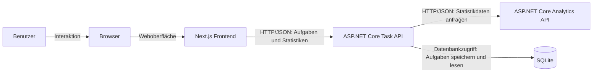

# Systemarchitektur

## Überblick

DistributedTaskFlow ist als verteilte Webanwendung geplant. Die Anwendung besteht aus einem browserbasierten Frontend, einer Task API, einer separaten Analytics API und einer SQLite-Datenbank.

Die Module haben klar getrennte Verantwortlichkeiten und kommunizieren über definierte Schnittstellen. Das Frontend ruft die Task API über HTTP und JSON auf. Die Task API verwaltet die Aufgaben, speichert sie in SQLite und ruft bei Bedarf die Analytics API auf, um Statistiken berechnen zu lassen.

## Architekturdiagramm

## Kommunikationswege

- Der Benutzer bedient die Anwendung im Browser.
- Der Browser stellt das Next.js-Frontend dar.
- Das Next.js-Frontend kommuniziert über HTTP und JSON mit der Task API.
- Die Task API stellt Funktionen für Aufgabenverwaltung und Persistenz bereit.
- Die Task API kommuniziert über HTTP und JSON mit der Analytics API.
- Die Task API liest und schreibt Aufgabendaten in SQLite.

## Warum die Anwendung verteilt ist

Die Anwendung gilt als verteilt, weil Frontend, Task API und Analytics API als eigenständige Module mit eigenen Verantwortlichkeiten geplant sind. Die fachliche Verarbeitung findet nicht in einem einzelnen Prozess statt, sondern wird auf mehrere separat ausführbare Komponenten aufgeteilt.

Die Kommunikation zwischen diesen Komponenten erfolgt über Netzwerkprotokolle und JSON-Daten. Dadurch kann jedes Modul unabhängig entwickelt, gestartet und später getestet werden.
