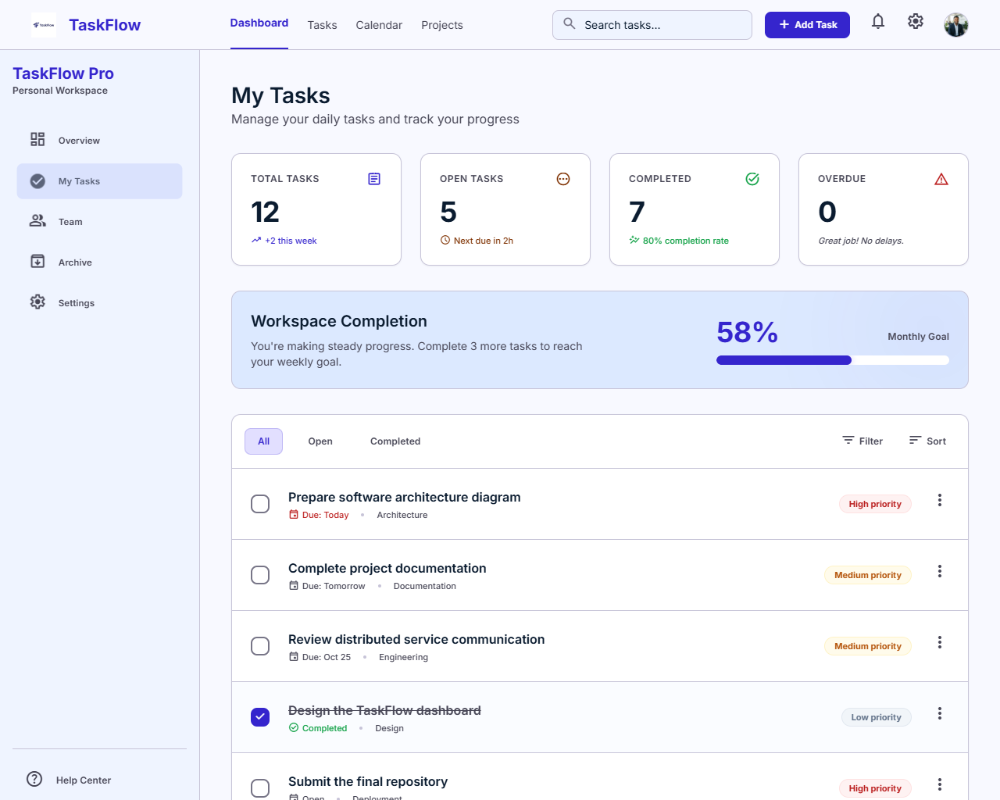
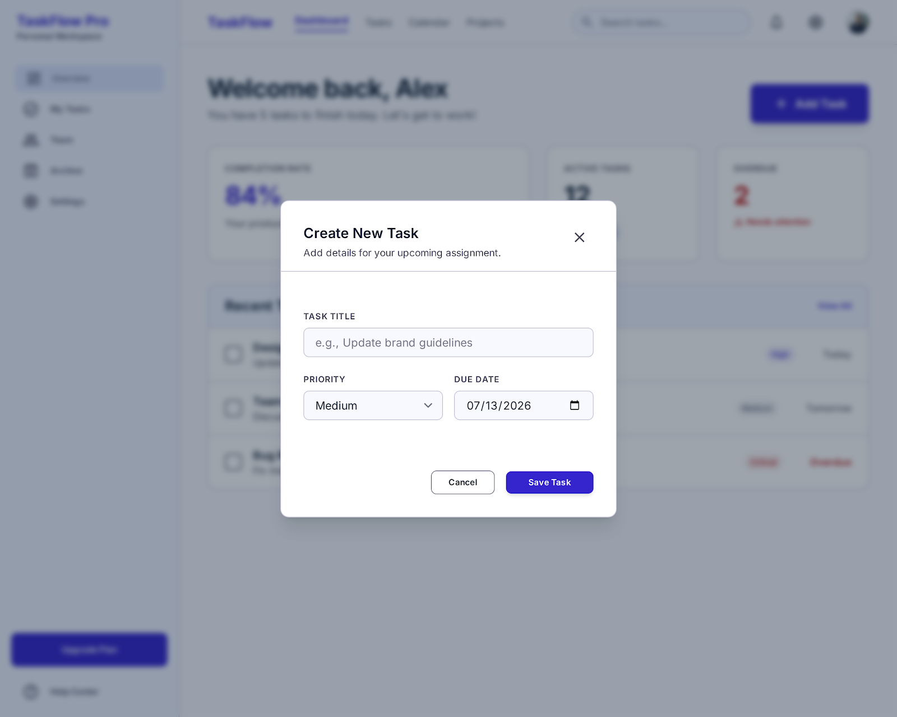
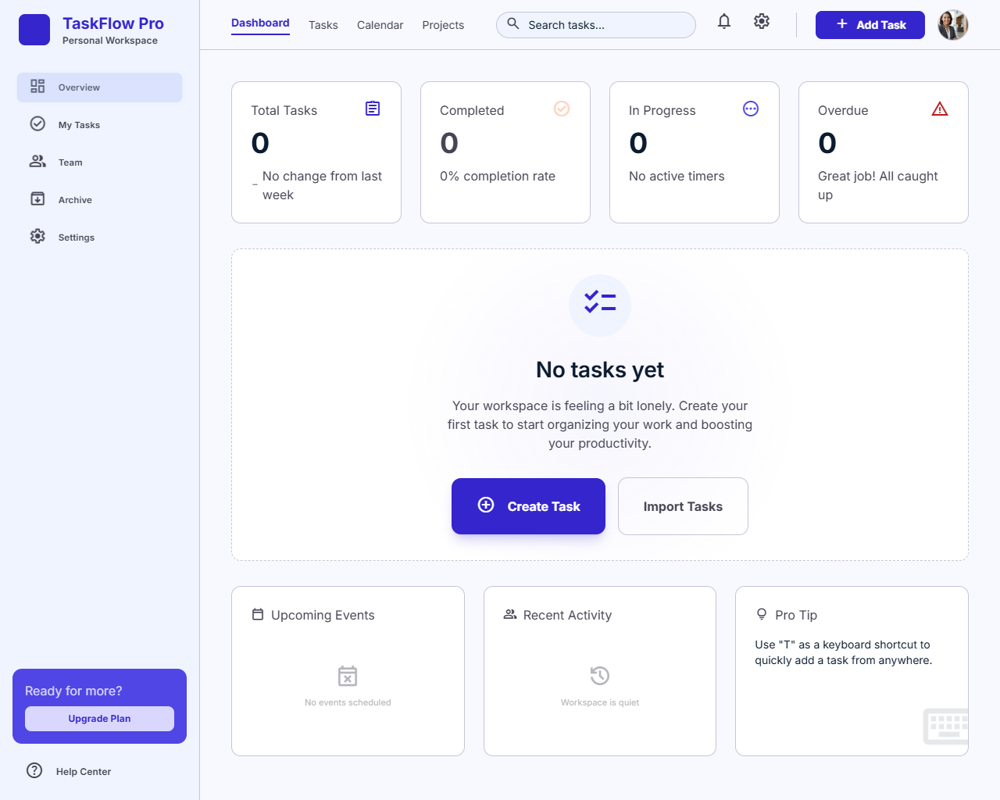
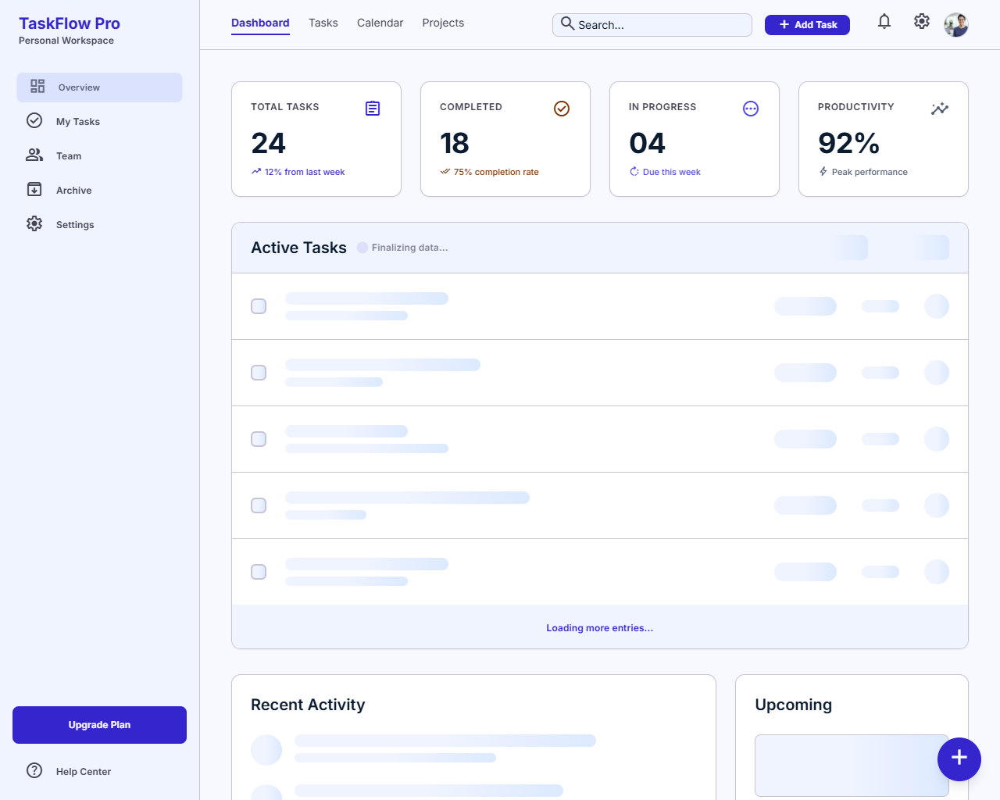
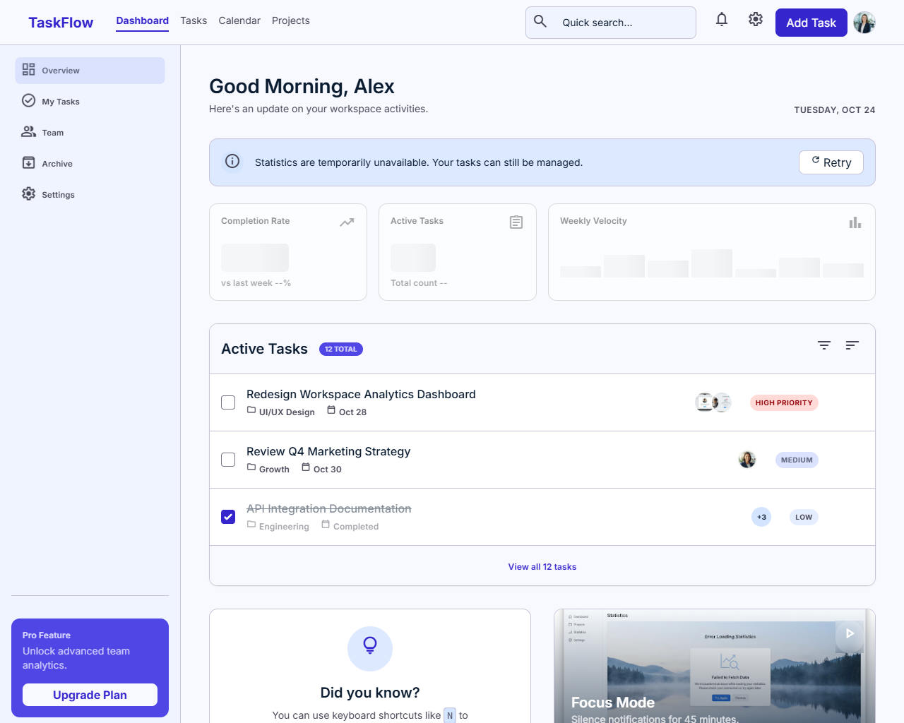
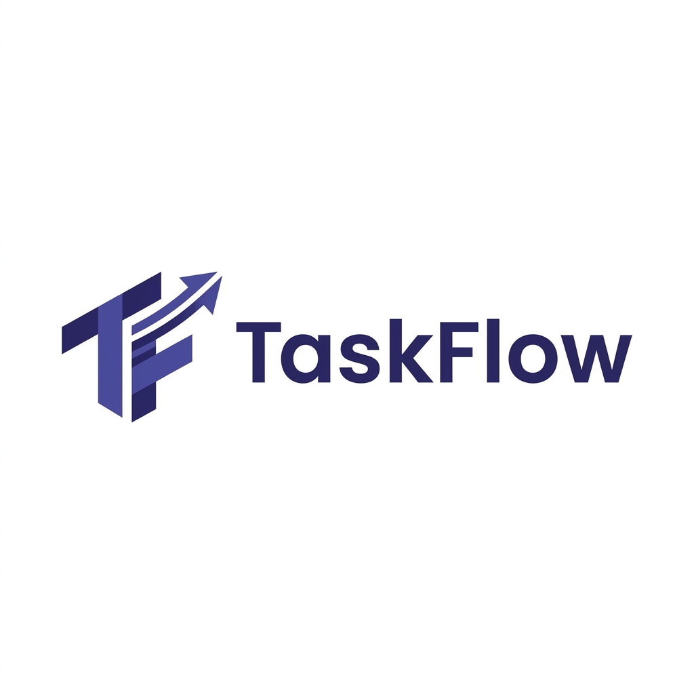

# Schritt 01 – UI-Design mit Google Stitch

## Ziel

Vor Beginn der technischen Implementierung wurde mit **Google Stitch** ein vollständiges visuelles Konzept für die TaskFlow-Webanwendung erstellt.

Ziel dieses Schritts war es, frühzeitig festzulegen:

- wie das Dashboard aufgebaut ist
- welche visuellen Zustände benötigt werden
- welche UI-Elemente wiederverwendet werden können
- wie sich die Anwendung auf unterschiedlichen Bildschirmgrößen verhalten soll
- wie Lade-, Leer- und Fehlerzustände dargestellt werden
- welches visuelle Erscheinungsbild für TaskFlow verwendet wird

In diesem Schritt wurde noch kein produktiver React- oder Next.js-Code implementiert. Die Stitch-Ausgaben dienten ausschließlich als Design- und Implementierungsgrundlage.

---

## Verwendetes Werkzeug

- Google Stitch

Google Stitch wurde verwendet, um aus einer textuellen Beschreibung mehrere zusammengehörige UI-Entwürfe zu erzeugen.

---

## Verwendeter Prompt

Der vollständige Prompt ist im Repository gespeichert:

- [Prompt 01 – UI-Design mit Google Stitch](../prompts/01-google-stitch.md)

Zusätzlich wurde die Verwendung des Prompts durch einen Screenshot dokumentiert:

- [Prompt in Google Stitch](../screenshots/stitch/stitch-01-prompt.png)

---

## Durchführung

Die Designphase wurde in mehreren Ansichten umgesetzt.

Dabei wurden sowohl der normale Anwendungszustand als auch wichtige Sonderzustände berücksichtigt.

Google Stitch erzeugte folgende Bereiche:

1. TaskFlow-Hauptdashboard
2. Dialog zum Erstellen einer Aufgabe
3. Dashboard ohne vorhandene Aufgaben
4. Ladezustand
5. Fehlerzustand des Statistikdienstes
6. TaskFlow-Logo

Für die meisten Ansichten wurden folgende Dateien exportiert:

- `code.html`
- `DESIGN.md`
- `screen.png`

Für das Logo wurden folgende Dateien erzeugt:

- `DESIGN.md`
- `logo.png`

---

## Generierte Ansichten und Dateien

### TaskFlow Dashboard

Das Hauptdashboard definiert die gemeinsame visuelle Struktur der Anwendung.

Es enthält unter anderem:

- Header
- Sidebar
- Suchfeld
- Dashboard-Titel
- Statistik-Karten
- Fortschrittsanzeige
- Statusfilter
- Aufgabenliste
- Add-Task-Aktion

Zugehörige Dateien:

- [HTML-Prototyp](../../stitch/TaskFlow%20Dashboard/code.html)
- [Designbeschreibung](../../stitch/TaskFlow%20Dashboard/DESIGN.md)
- [Generierter Screen](../../stitch/TaskFlow%20Dashboard/screen.png)

Dokumentierter Screenshot:

- [TaskFlow-Hauptdashboard](../screenshots/stitch/stitch-02-main-dashboard.png)

---

### Add Task Modal

Diese Ansicht zeigt den Dialog zum Erstellen einer neuen Aufgabe über dem bestehenden Dashboard.

Der Entwurf enthält:

- Modal-Overlay
- Titel-Eingabefeld
- Prioritätsauswahl
- Fälligkeitsdatum
- Abbrechen-Aktion
- Speichern-Aktion
- Schließen-Button

Zugehörige Dateien:

- [HTML-Prototyp](../../stitch/Add%20Task%20Modal/code.html)
- [Designbeschreibung](../../stitch/Add%20Task%20Modal/DESIGN.md)
- [Generierter Screen](../../stitch/Add%20Task%20Modal/screen.png)

Dokumentierter Screenshot:

- [Add-Task-Dialog](../screenshots/stitch/stitch-03-add-task-modal.png)

---

### Empty State Dashboard

Diese Ansicht beschreibt den Zustand, in dem noch keine Aufgaben vorhanden sind.

Der Entwurf enthält:

- Empty-State-Illustration
- erklärenden Text
- primäre Create-Task-Aktion
- weiterhin sichtbare Dashboard-Struktur
- Statistikwerte ohne vorhandene Aufgaben

Zugehörige Dateien:

- [HTML-Prototyp](../../stitch/Empty%20State%20Dashboard/code.html)
- [Designbeschreibung](../../stitch/Empty%20State%20Dashboard/DESIGN.md)
- [Generierter Screen](../../stitch/Empty%20State%20Dashboard/screen.png)

Dokumentierter Screenshot:

- [Empty State](../screenshots/stitch/stitch-04-empty-state.png)

---

### Loading State Dashboard

Diese Ansicht zeigt den Zustand während des Ladens von Aufgaben und Statistiken.

Der Entwurf verwendet:

- Skeleton-Karten
- Skeleton-Zeilen
- Ladehinweise
- Shimmer-Animationen
- weiterhin erkennbare Dashboard-Struktur

Zugehörige Dateien:

- [HTML-Prototyp](../../stitch/Loading%20State%20Dashboard/code.html)
- [Designbeschreibung](../../stitch/Loading%20State%20Dashboard/DESIGN.md)
- [Generierter Screen](../../stitch/Loading%20State%20Dashboard/screen.png)

Dokumentierter Screenshot:

- [Loading State](../screenshots/stitch/stitch-05-loading-state.png)

---

### Statistics Error State

Diese Ansicht beschreibt den Fehlerfall, in dem die Statistikdaten nicht verfügbar sind.

Wichtig war dabei, dass die Aufgabenverwaltung weiterhin sichtbar und nutzbar bleibt.

Der Entwurf enthält:

- Fehlerhinweis
- Retry-Aktion
- deaktiviert wirkende Statistikbereiche
- weiterhin nutzbare Aufgabenliste
- klare Trennung zwischen Statistikfehler und Aufgabenverwaltung

Zugehörige Dateien:

- [HTML-Prototyp](../../stitch/Statistics%20Error%20State/code.html)
- [Designbeschreibung](../../stitch/Statistics%20Error%20State/DESIGN.md)
- [Generierter Screen](../../stitch/Statistics%20Error%20State/screen.png)

Dokumentierter Screenshot:

- [Statistics Error State](../screenshots/stitch/stitch-06-error-state.png)

---

### TaskFlow Logo

Zusätzlich wurde ein eigenes Logo für die Anwendung erstellt.

Das Logo dient als visuelle Grundlage für:

- Branding
- Sidebar
- Header
- lokale Frontend-Assets

Zugehörige Dateien:

- [Designbeschreibung](../../stitch/TaskFlow%20Logo/DESIGN.md)
- [Logo-Asset](../../stitch/TaskFlow%20Logo/logo.png)

Dokumentierter Screenshot:

- [TaskFlow-Logo](../screenshots/stitch/stitch-07-logo.png)

---

## Aufbau der Google-Stitch-Ausgaben

### HTML-Prototypen

Die Dateien `code.html` enthalten vollständige statische Webprototypen.

Je nach Ansicht enthalten sie:

- HTML-Struktur
- eingebettete Styles
- Tailwind-Utility-Klassen
- Tailwind-Konfiguration
- externe Font- und Icon-Referenzen
- kleine JavaScript-Demofunktionen
- vollständige Seitenstrukturen

Die Prototypen können direkt im Browser geöffnet und visuell geprüft werden.

Sie wurden jedoch nicht unverändert in das endgültige Frontend übernommen.

### Designbeschreibungen

Die Dateien `DESIGN.md` dokumentieren zentrale visuelle Entscheidungen.

Dazu gehören unter anderem:

- Farben
- Typografie
- Abstände
- Größen
- Komponentenstile
- visuelle Hierarchie
- Responsive-Verhalten
- Interaktionen
- Zustände

Diese Informationen wurden später gemeinsam mit den HTML-Dateien und Screenshots analysiert.

---

## Designentscheidung für die spätere Umsetzung

Die Google-Stitch-Ausgaben wurden als visuelle und technische Referenz verwendet.

Für das endgültige Frontend wurde entschieden:

- keine direkte Übernahme der vollständigen HTML-Seiten
- keine Verwendung des erzeugten Tailwind-CDN-Codes
- keine Übernahme eingebetteter Demo-Scripts
- keine Duplizierung vollständiger Dashboard-Strukturen
- Aufteilung in kleine React-Komponenten
- Verwendung von JSX
- Verwendung von Plain CSS und CSS Modules
- zentrale Definition von Design-Tokens
- lokale Verwendung des TaskFlow-Logos

Die geplanten Frontend-Technologien waren:

- Next.js
- React
- JavaScript
- JSX
- App Router
- Plain CSS
- CSS Modules

Die genaue Komponentenstruktur wurde erst nach einer separaten Analyse der Stitch-Dateien festgelegt.

---

## Nachweis

Alle ausgewählten Screenshots dieser Designphase befinden sich unter:

- [Stitch-Screenshots](../screenshots/stitch/)

Alle unveränderten Google-Stitch-Ausgaben befinden sich unter:

- [Google-Stitch-Ausgaben](../../stitch/)

---

## Ergebnis

Das vollständige UI-Konzept wurde vor Beginn der technischen Implementierung erstellt.

Dieser Schritt lieferte:

- ein gemeinsames visuelles Erscheinungsbild
- ein Hauptdashboard
- ein Add-Task-Modal
- einen Empty State
- einen Loading State
- einen Statistics Error State
- ein TaskFlow-Logo
- HTML-Prototypen
- Designbeschreibungen
- Screenshots als Nachweis
- einen gespeicherten Prompt

Die Stitch-Ausgaben bildeten damit die Grundlage für die spätere Analyse und Umsetzung des Next.js-Frontends.