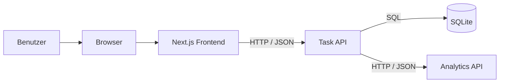

# Schritt 02 – Projektplanung und Systemarchitektur

## Ziel

In diesem Schritt wurde die technische Grundlage für **DistributedTaskFlow** geplant.

Ziel war es, die Anwendung vor Beginn der Implementierung in klar abgegrenzte Module aufzuteilen und die Verantwortlichkeiten, Kommunikationswege und technischen Grenzen dieser Module festzulegen.

DistributedTaskFlow sollte nicht nur aus einem Frontend und einem Backend bestehen. Die Statistikberechnung wurde deshalb bewusst in einen separaten Dienst ausgelagert.

Dadurch entsteht eine kleine verteilte Anwendung, in der mehrere unabhängig gestartete Prozesse über HTTP und JSON zusammenarbeiten.

In diesem Planungsschritt wurde noch kein Anwendungscode implementiert.

---

## Verwendetes Werkzeug

- Codex CLI
- Markdown
- Mermaid

Codex CLI wurde verwendet, um die Anforderungen zu analysieren und daraus eine nachvollziehbare Systemarchitektur abzuleiten.

Mermaid wurde für die grafische Darstellung der geplanten Kommunikation eingesetzt.

---

## Verwendeter Prompt

Der vollständige Prompt dieses Planungsschritts ist im Repository gespeichert:

- [Prompt 02 – Projektplanung und Systemarchitektur](../prompts/02-project-planning.md)

Der Prompt dokumentiert unter anderem:

- die Projektidee
- die funktionalen Anforderungen
- die gewünschte verteilte Architektur
- die vorgesehenen Technologien
- die geplanten Design Patterns
- die Anforderungen an die Projektdokumentation

---

## Ausgangslage

Vor diesem Planungsschritt war bereits das visuelle Konzept der Anwendung vorhanden.

Mit Google Stitch wurden unter anderem folgende Zustände entworfen:

- Hauptdashboard
- Add-Task-Modal
- Empty State
- Loading State
- Statistics Error State
- TaskFlow-Logo

Diese Entwürfe definierten das spätere Erscheinungsbild der Anwendung.

In Schritt 02 wurde festgelegt, welche technischen Module erforderlich sind, damit diese Oberfläche mit echten Daten und einer verteilten Backend-Struktur umgesetzt werden kann.

---

## Geplante Systemarchitektur

Die Anwendung wurde in vier technische Hauptbereiche aufgeteilt:

```text
Browser
   |
   v
Next.js Frontend
   |
   v
Task API
   | \
   |  \--> SQLite
   |
   v
Analytics API
```

Als Mermaid-Diagramm:



Die ausführliche Architekturzeichnung befindet sich in:

- [Systemarchitektur und Architekturdiagramm](../diagrams/system-architecture.md)

---

## Geplante Module

| Modul | Technologie | Hauptverantwortung |
| --- | --- | --- |
| Browser | Webbrowser | Darstellung und Bedienung der Anwendung |
| Next.js Frontend | Next.js, React, JavaScript, JSX und CSS Modules | Benutzeroberfläche und Kommunikation mit der Task API |
| Task API | ASP.NET Core | Aufgabenverwaltung, Validierung, Persistenz und zentrale API-Schnittstelle |
| Analytics API | ASP.NET Core | Berechnung der Aufgabenstatistiken |
| Datenbank | SQLite | Dauerhafte Speicherung der Aufgaben |

---

## Verantwortlichkeiten der Module

### Browser

Der Browser stellt die Laufzeitumgebung für die Benutzeroberfläche bereit.

Der Benutzer verwendet die Anwendung vollständig über den Browser.

Zu den Benutzeraktionen gehören:

- Aufgaben anzeigen
- Aufgaben erstellen
- Aufgaben bearbeiten
- Aufgaben abschließen oder wieder öffnen
- Aufgaben löschen
- Aufgaben durchsuchen
- Aufgaben filtern
- Statistikstrategien auswählen

Der Browser kommuniziert nicht direkt mit der Datenbank und nicht direkt mit der Analytics API.

---

### Next.js Frontend

Das Frontend stellt die vollständige Benutzeroberfläche der Anwendung bereit.

Zu seinen Verantwortlichkeiten gehören:

- Aufgaben anzeigen
- neue Aufgaben erfassen
- vorhandene Aufgaben bearbeiten
- Aufgaben als erledigt oder offen markieren
- Aufgaben löschen
- Aufgaben nach Titel durchsuchen
- Aufgaben nach Status filtern
- Dashboard-Statistiken darstellen
- zwischen Statistikstrategien wechseln
- Ladezustände anzeigen
- einen Empty State anzeigen
- Fehlerzustände darstellen
- Benutzereingaben an die Task API senden

Das Frontend enthält keine direkte Datenbanklogik.

Es kommuniziert ausschließlich über HTTP und JSON mit der Task API.

Geplanter lokaler Port:

```text
http://localhost:3000
```

---

### Task API

Die Task API bildet die zentrale Schnittstelle des Systems.

Sie verbindet:

- das Frontend
- die SQLite-Datenbank
- die Analytics API

Zu ihren Verantwortlichkeiten gehören:

- Aufgaben laden
- Aufgaben erstellen
- Aufgaben bearbeiten
- Aufgaben löschen
- Aufgabenstatus ändern
- Eingaben validieren
- Aufgaben nach Status filtern
- Aufgaben nach Titel durchsuchen
- Aufgaben in SQLite speichern
- gespeicherte Aufgaben aus SQLite lesen
- Dashboardanfragen entgegennehmen
- Aufgabendaten an die Analytics API senden
- Statistikantworten an das Frontend weitergeben
- Fehler der Analytics API in eine kontrollierte API-Antwort umwandeln

Die Task API ist die einzige Schnittstelle, die vom Frontend aufgerufen wird.

Geplanter lokaler Port:

```text
http://localhost:5001
```

---

### Analytics API

Die Analytics API ist ein eigenständiger Prozess.

Sie ist ausschließlich für die Berechnung von Aufgabenstatistiken verantwortlich.

Geplante Berechnungen:

- Gesamtanzahl der Aufgaben
- Anzahl offener Aufgaben
- Anzahl erledigter Aufgaben
- Anzahl überfälliger Aufgaben
- prozentuale Abschlussquote
- gewichtete Bewertung offener Aufgaben

Die Analytics API speichert keine Aufgaben dauerhaft.

Sie erhält die benötigten Aufgabendaten bei jeder Berechnung über HTTP und JSON von der Task API.

Anschließend berechnet sie die Statistik und sendet das Ergebnis zurück.

Geplanter lokaler Port:

```text
http://localhost:5002
```

---

### SQLite-Datenbank

SQLite übernimmt die dauerhafte Speicherung der Aufgaben.

Gespeichert werden unter anderem:

- Aufgaben-ID
- Titel
- Priorität
- Fälligkeitsdatum
- Abschlussstatus
- Erstellungszeitpunkt

Der Datenbankzugriff erfolgt ausschließlich über die Task API.

Folgende Module greifen nicht direkt auf SQLite zu:

- Browser
- Next.js Frontend
- Analytics API

Dadurch bleibt der Datenzugriff an einer zentralen Stelle gekapselt.

---

## Kommunikationswege

### Aufgabenverwaltung

Für normale Aufgabenoperationen wurde folgender Ablauf geplant:

```text
Benutzer
→ Browser
→ Next.js Frontend
→ Task API
→ SQLite
```

Beispiel für das Laden der Aufgaben:

1. Der Benutzer öffnet das Dashboard.
2. Das Frontend sendet eine HTTP-Anfrage an die Task API.
3. Die Task API lädt die Aufgaben aus SQLite.
4. Die Task API gibt die Aufgaben als JSON zurück.
5. Das Frontend stellt die Aufgaben im Browser dar.

---

### Statistikberechnung

Für die Statistikberechnung wurde folgender verteilter Ablauf geplant:

```text
Benutzer
→ Browser
→ Next.js Frontend
→ Task API
→ Analytics API
→ Task API
→ Next.js Frontend
→ Browser
```

Der vollständige Ablauf lautet:

1. Das Frontend fordert Dashboard-Statistiken bei der Task API an.
2. Die Task API lädt die aktuellen Aufgaben aus SQLite.
3. Die Task API übermittelt die Aufgabendaten über HTTP an die Analytics API.
4. Die Analytics API wählt die gewünschte Berechnungsstrategie.
5. Die Analytics API berechnet die Statistik.
6. Die Analytics API sendet das Ergebnis als JSON an die Task API zurück.
7. Die Task API gibt die Statistik an das Frontend weiter.
8. Das Frontend zeigt die Werte im Dashboard an.

Diese Kommunikation bildet den zentralen verteilten Teil des Projekts.

---

## Warum die Anwendung verteilt ist

Die Anwendung besteht nicht nur aus unterschiedlichen Codebereichen innerhalb eines einzigen Prozesses.

Task API und Analytics API sind:

- separate ASP.NET-Core-Projekte
- getrennt gestartete Prozesse
- über unterschiedliche Ports erreichbar
- unabhängig voneinander ausführbar
- ausschließlich über HTTP und JSON miteinander verbunden

Die Task API kann Aufgaben weiterhin verwalten, auch wenn die Analytics API nicht erreichbar ist.

Damit wird eine echte Prozessgrenze zwischen Aufgabenverwaltung und Statistikberechnung geschaffen.

---

## Geplante API-Grenzen

### Frontend zur Task API

Das Frontend sollte später unter anderem folgende Funktionen über die Task API verwenden:

```text
GET    /api/tasks
POST   /api/tasks
PUT    /api/tasks/{id}
PATCH  /api/tasks/{id}/toggle
DELETE /api/tasks/{id}
GET    /api/dashboard
```

### Task API zur Analytics API

Die interne Kommunikation sollte über einen Statistikendpunkt erfolgen:

```text
POST /api/statistics
```

Die genaue Endpunktstruktur und die Request- und Response-Modelle wurden erst in den späteren Implementierungsschritten festgelegt.

---

## Geplante Design Patterns

### Repository Pattern

Der Datenbankzugriff sollte hinter einer Repository-Schnittstelle gekapselt werden.

Geplante Verantwortung:

- SQLite-Befehle ausführen
- Aufgaben speichern
- Aufgaben laden
- Datenbankdetails von der restlichen Anwendung trennen

Dadurch sollte es möglich sein, die Datenzugriffslogik unabhängig von der Geschäftslogik zu verändern.

---

### Service Layer

Die Geschäftslogik der Task API sollte in einer eigenen Service-Schicht umgesetzt werden.

Geplante Aufgaben:

- Eingaben validieren
- Repository aufrufen
- Aufgabenoperationen koordinieren
- Fehler kontrolliert behandeln

Die HTTP-Endpunkte sollten dadurch möglichst klein und übersichtlich bleiben.

---

### Strategy Pattern

Die Analytics API sollte mehrere Statistikvarianten unterstützen.

Geplant wurden:

- Basic Statistics
- Weighted Statistics

Beide Varianten sollten dieselbe Schnittstelle verwenden und zur Laufzeit über einen Strategienamen ausgewählt werden können.

---

### Adapter beziehungsweise Gateway Pattern

Die HTTP-Kommunikation mit der Analytics API sollte in einer eigenen Client-Klasse gekapselt werden.

Die restliche Task API sollte keine direkten Details über:

- HTTP-Aufrufe
- JSON-Serialisierung
- Zieladresse der Analytics API
- Netzwerkfehler

kennen müssen.

---

### Dependency Injection

Repositories, Services, Strategien und der Analytics Client sollten über Dependency Injection registriert werden.

Dadurch bleiben die Komponenten:

- lose gekoppelt
- austauschbar
- übersichtlich
- klar voneinander getrennt

---

## Geplantes Fehlerverhalten

Ein wichtiger Teil der Architekturplanung war der Umgang mit einem Ausfall der Analytics API.

Wenn die Analytics API nicht erreichbar ist, sollte:

- die Task API weiterhin erreichbar bleiben
- die SQLite-Datenbank weiterhin verwendet werden können
- die Aufgabenliste weiterhin geladen werden
- das Erstellen von Aufgaben weiterhin funktionieren
- das Bearbeiten von Aufgaben weiterhin funktionieren
- das Umschalten des Aufgabenstatus weiterhin funktionieren
- das Löschen von Aufgaben weiterhin funktionieren
- nur die Statistikberechnung fehlschlagen
- das Frontend einen klaren Statistikfehler anzeigen
- eine erneute Anfrage über eine Retry-Aktion möglich sein

Geplante Fehlermeldung:

```text
Statistics are temporarily unavailable. Your tasks can still be managed.
```

Damit sollte verhindert werden, dass der Ausfall eines einzelnen Dienstes die gesamte Anwendung unbrauchbar macht.

---

## Geplante Projektstruktur

Die geplante Grundstruktur sah folgendermaßen aus:

```text
DistributedTaskFlow/
├── backend/
│   ├── TaskFlow.sln
│   ├── TaskFlow.TaskApi/
│   └── TaskFlow.AnalyticsApi/
├── frontend/
├── docs/
│   ├── diagrams/
│   ├── prompts/
│   ├── screenshots/
│   └── steps/
├── stitch/
├── .gitignore
└── README.md
```

Die tatsächlichen Quellcodedateien wurden erst in den folgenden Schritten erstellt.

---

## Nicht Bestandteil dieses Schritts

In Schritt 02 wurde bewusst noch kein produktiver Code implementiert.

Nicht Bestandteil dieses Schritts waren:

- Erstellung der .NET-Solution
- Implementierung der Task API
- Erstellung der SQLite-Datenbank
- Implementierung der Analytics API
- Einrichtung von Swagger UI
- Erstellung des Next.js-Projekts
- Implementierung der React-Komponenten
- Verbindung des Frontends mit der Task API

Dieser Schritt konzentrierte sich ausschließlich auf Planung, Architektur und Verantwortlichkeiten.

---

## Zugehörige Dateien

Zu diesem Schritt gehören ausschließlich folgende Dokumente:

- [Prompt 02 – Projektplanung und Systemarchitektur](../prompts/02-project-planning.md)
- [Systemarchitektur und Architekturdiagramm](../diagrams/system-architecture.md)

Da in diesem Schritt noch kein Anwendungscode erstellt wurde, existieren keine zugehörigen Backend- oder Frontend-Quelldateien.

---

## Nachweis

Der Planungsschritt wird durch folgende Dateien nachvollziehbar dokumentiert:

- gespeicherter Codex-Prompt
- schriftliche Architekturentscheidung
- Mermaid-Systemdiagramm
- Beschreibung der Prozessgrenzen
- Beschreibung der Kommunikationswege
- Definition der Modulverantwortlichkeiten
- Planung des Fehlerverhaltens

Für diesen Schritt wurde kein separater Screenshot benötigt, da das Ergebnis vollständig durch die Architektur- und Markdown-Dokumentation dargestellt wird.

---

## Ergebnis

Die technische Struktur von DistributedTaskFlow wurde vor Beginn der Implementierung vollständig geplant.

Am Ende dieses Schritts waren folgende Entscheidungen festgelegt:

- Next.js wird für das Frontend verwendet.
- ASP.NET Core wird für beide APIs verwendet.
- SQLite wird zur dauerhaften Speicherung eingesetzt.
- Das Frontend kommuniziert nur mit der Task API.
- Die Task API übernimmt die zentrale Koordination.
- Die Analytics API läuft als separater Prozess.
- Task API und Analytics API kommunizieren über HTTP und JSON.
- Repository, Service Layer, Strategy, Gateway und Dependency Injection werden eingesetzt.
- Der Ausfall der Analytics API blockiert nicht die Aufgabenverwaltung.

Damit lag eine klare und nachvollziehbare Grundlage für die folgenden Implementierungsschritte vor.