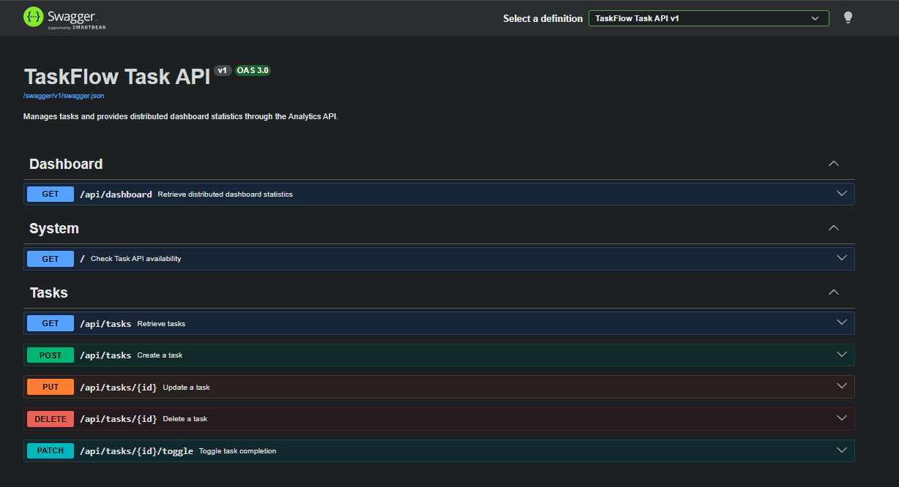
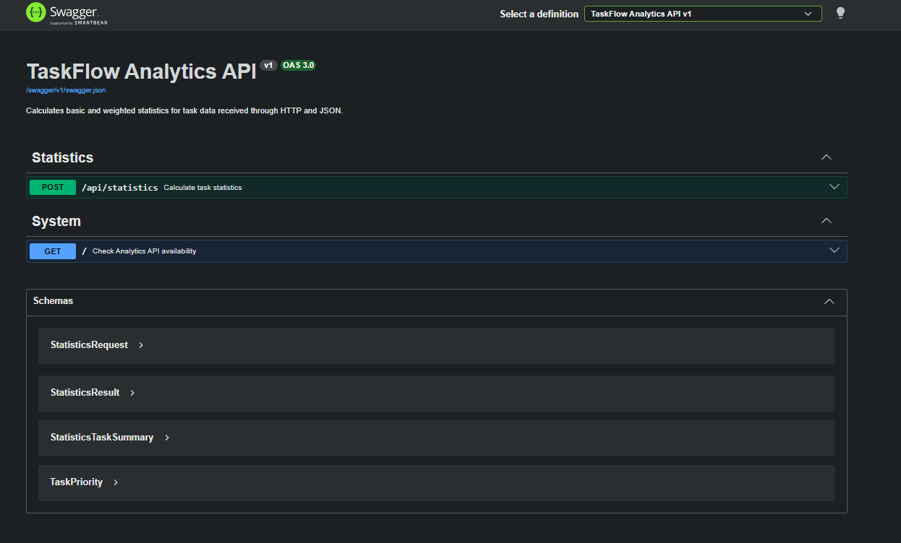

# Schritt 06 – Swagger UI und OpenAPI-Dokumentation

## Ziel

In diesem Schritt wurden beide bestehenden ASP.NET-Core-APIs um eine interaktive OpenAPI-Dokumentation mit Swagger UI erweitert.

Ziel war es, die vorhandenen Endpunkte direkt im Browser:

- übersichtlich darzustellen
- nach Funktionsbereichen zu gruppieren
- mit verständlichen Beschreibungen zu dokumentieren
- mit Query-, Path- und Request-Body-Parametern auszuführen
- anhand ihrer Statuscodes und Response-Modelle zu überprüfen

Die bestehende Anwendungslogik wurde dabei nicht verändert.

Unverändert blieben insbesondere:

- Aufgabenverwaltung
- Eingabevalidierung
- SQLite-Persistenz
- Repository Pattern
- Service Layer
- Statistikstrategien
- HTTP-Kommunikation zwischen den APIs
- Dashboard-Endpunkt
- Fehlerverhalten bei Ausfall der Analytics API

---

## Verwendete Werkzeuge und Technologien

- Codex CLI
- .NET CLI
- ASP.NET Core
- Swashbuckle
- Swagger UI
- OpenAPI
- NuGet
- PowerShell
- HTTP-Requests

---

## Verwendeter Prompt

Der vollständige Prompt dieses Schritts ist im Repository gespeichert:

- [Prompt 06 – Swagger UI für beide APIs](../prompts/06-swagger-ui.md)

Der Prompt definierte unter anderem:

- Swagger UI für beide APIs
- getrennte OpenAPI-Dokumente
- individuelle API-Titel
- Beschreibungen der Endpunkte
- Gruppierung über Tags
- Request- und Response-Schemas
- Dokumentation der Statuscodes
- Sicherheitsprüfung der NuGet-Pakete
- vollständige Build- und Laufzeitprüfung

---

## Ausgangslage

Vor diesem Schritt waren beide Backend-Dienste bereits funktional umgesetzt.

### Task API

Die Task API verfügte bereits über:

- Aufgaben-CRUD
- SQLite-Persistenz
- Repository Pattern
- Service Layer
- Statusfilter
- Titelsuche
- Analytics Client
- Dashboard-Endpunkt
- kontrollierte `503`-Antwort bei Ausfall der Analytics API

### Analytics API

Die Analytics API verfügte bereits über:

- Statistikmodelle
- Basic-Strategie
- Weighted-Strategie
- Strategy Pattern
- Statistikendpunkt
- Strategieauswahl über Query-Parameter

Die Endpunkte konnten bereits über HTTP aufgerufen werden.

Eine interaktive Browserdokumentation war jedoch noch nicht vorhanden.

---

## Installation der Swagger-Pakete

In beiden API-Projekten wurde folgendes Paket verwendet:

```text
Swashbuckle.AspNetCore 10.2.3
```

Das Paket stellt unter anderem bereit:

- OpenAPI-Dokumentgenerierung
- Swagger-Middleware
- Swagger UI
- automatische Schemaerzeugung
- Dokumentation von Request- und Response-Modellen

Transitiv wurde folgende OpenAPI-Version verwendet:

```text
Microsoft.OpenApi 2.7.5
```

Für die OpenAPI-Metadaten wurde deshalb der aktuelle Namespace verwendet:

```csharp
Microsoft.OpenApi
```

Es wurden keine zusätzlichen oder konkurrierenden Dokumentationswerkzeuge installiert, beispielsweise:

- NSwag
- Scalar
- ReDoc

---

## Swagger-Konfiguration der Task API

Die Swagger-Konfiguration wurde in folgender Datei ergänzt:

- [`Program.cs`](../../backend/TaskFlow.TaskApi/Program.cs)

Registriert wurden:

```csharp
AddEndpointsApiExplorer()
AddSwaggerGen()
```

Das OpenAPI-Dokument verwendet:

| Eigenschaft | Wert |
| --- | --- |
| Dokumentname | `v1` |
| Titel | `TaskFlow Task API` |
| Version | `v1` |
| Beschreibung | `Manages tasks and provides distributed dashboard statistics through the Analytics API.` |

Swagger wird nur in der Development-Umgebung aktiviert.

Dafür werden folgende Middleware-Komponenten verwendet:

```csharp
UseSwagger()
UseSwaggerUI()
```

---

## Adressen der Task API

### Swagger UI

```text
http://localhost:5001/swagger
```

### OpenAPI-JSON

```text
http://localhost:5001/swagger/v1/swagger.json
```

Der Seitentitel der Swagger UI lautet:

```text
TaskFlow Task API
```

---

## Swagger-Konfiguration der Analytics API

Die Swagger-Konfiguration wurde in folgender Datei ergänzt:

- [`Program.cs`](../../backend/TaskFlow.AnalyticsApi/Program.cs)

Auch hier wurden registriert:

```csharp
AddEndpointsApiExplorer()
AddSwaggerGen()
```

Das OpenAPI-Dokument verwendet:

| Eigenschaft | Wert |
| --- | --- |
| Dokumentname | `v1` |
| Titel | `TaskFlow Analytics API` |
| Version | `v1` |
| Beschreibung | `Calculates basic and weighted statistics for task data received through HTTP and JSON.` |

Swagger wird auch in diesem Projekt ausschließlich in der Development-Umgebung aktiviert.

---

## Adressen der Analytics API

### Swagger UI

```text
http://localhost:5002/swagger
```

### OpenAPI-JSON

```text
http://localhost:5002/swagger/v1/swagger.json
```

Der Seitentitel der Swagger UI lautet:

```text
TaskFlow Analytics API
```

---

## OpenAPI-Metadaten

Die Minimal-API-Endpunkte wurden um kompakte OpenAPI-Metadaten ergänzt.

Verwendet wurden unter anderem:

```text
WithName
WithTags
WithSummary
WithDescription
Accepts
Produces
```

Dadurch zeigt Swagger UI:

- sprechende Namen der Operationen
- kurze Zusammenfassungen
- ausführlichere Beschreibungen
- Request-Body-Typen
- Query-Parameter
- Path-Parameter
- Response-Statuscodes
- Response-Schemas
- Enumwerte
- Validierungsmodelle

---

## Gruppierung der Endpunkte

Die Endpunkte wurden über Tags logisch gruppiert.

Verwendete Tags:

| Tag | Inhalt |
| --- | --- |
| `System` | Root- und Statusendpunkte |
| `Tasks` | Aufgabenverwaltung |
| `Dashboard` | verteilte Dashboard-Statistiken |
| `Statistics` | interne Statistikberechnung |

Dadurch können die Endpunkte in Swagger UI schneller gefunden und nachvollzogen werden.

---

# Dokumentation der Task API

Die Task API dokumentiert folgende Endpunkte:

| Methode | Route | Beschreibung |
| --- | --- | --- |
| `GET` | `/` | Verfügbarkeit der Task API prüfen |
| `GET` | `/api/tasks` | Aufgaben laden, filtern und durchsuchen |
| `POST` | `/api/tasks` | Neue Aufgabe erstellen |
| `PUT` | `/api/tasks/{id}` | Bestehende Aufgabe aktualisieren |
| `PATCH` | `/api/tasks/{id}/toggle` | Abschlussstatus umschalten |
| `DELETE` | `/api/tasks/{id}` | Aufgabe löschen |
| `GET` | `/api/dashboard` | Verteilte Dashboard-Statistiken abrufen |

---

## Dokumentierte Query-Parameter der Task API

### Aufgaben laden

Endpunkt:

```text
GET /api/tasks
```

Dokumentierte Query-Parameter:

| Parameter | Typ | Beschreibung |
| --- | --- | --- |
| `status` | String | Filtert nach Aufgabenstatus |
| `search` | String | Durchsucht den Aufgabentitel |

Unterstützte Statuswerte:

```text
all
open
completed
```

Beispiele:

```text
GET /api/tasks?status=open
GET /api/tasks?search=Swagger
GET /api/tasks?status=open&search=Documentation
```

---

### Dashboard laden

Endpunkt:

```text
GET /api/dashboard
```

Dokumentierter Query-Parameter:

| Parameter | Typ | Beschreibung |
| --- | --- | --- |
| `strategy` | String | Wählt die Statistikstrategie |

Unterstützte Werte:

```text
basic
weighted
```

Ohne Query-Parameter wird verwendet:

```text
basic
```

Beispiele:

```text
GET /api/dashboard?strategy=basic
GET /api/dashboard?strategy=weighted
```

---

## Dokumentierte Request-Bodies der Task API

Swagger UI erzeugt editierbare Request-Bodies für das Erstellen und Bearbeiten einer Aufgabe.

Beispiel:

```json
{
  "title": "Document Swagger UI",
  "priority": "High",
  "dueDate": "2026-07-15"
}
```

Dokumentierte Prioritätswerte:

```text
Low
Medium
High
```

Die OpenAPI-Dokumentation zeigt außerdem:

- erforderliche Felder
- Datentypen
- Datumsformat
- Enumwerte
- Response-Modell von `TaskItem`

---

## Dokumentierte Statuscodes der Task API

| Endpunkt | Erfolgsstatus | Mögliche Fehler |
| --- | --- | --- |
| `GET /api/tasks` | `200` | `400` |
| `POST /api/tasks` | `201` | `400` |
| `PUT /api/tasks/{id}` | `200` | `400`, `404` |
| `PATCH /api/tasks/{id}/toggle` | `200` | `404` |
| `DELETE /api/tasks/{id}` | `204` | `404` |
| `GET /api/dashboard` | `200` | `400`, `503` |

Damit wird in Swagger UI sichtbar, welche Antworten ein Client erwarten kann.

---

# Dokumentation der Analytics API

Die Analytics API dokumentiert folgende Endpunkte:

| Methode | Route | Beschreibung |
| --- | --- | --- |
| `GET` | `/` | Verfügbarkeit der Analytics API prüfen |
| `POST` | `/api/statistics` | Aufgabenstatistiken berechnen |

---

## Dokumentierter Statistikendpunkt

Endpunkt:

```text
POST /api/statistics
```

Dokumentierter Query-Parameter:

| Parameter | Typ | Beschreibung |
| --- | --- | --- |
| `strategy` | String | Auswahl der Berechnungsstrategie |

Unterstützte Werte:

```text
basic
weighted
```

Ohne Angabe wird verwendet:

```text
basic
```

---

## Dokumentierter Statistik-Request

Swagger UI zeigt das Request-Schema der Analytics API.

Beispiel:

```json
{
  "tasks": [
    {
      "priority": "High",
      "dueDate": "2026-07-10",
      "isCompleted": false
    },
    {
      "priority": "Medium",
      "dueDate": "2026-07-15",
      "isCompleted": true
    }
  ]
}
```

Dokumentiert werden:

- Task-Summary
- Priorität
- Fälligkeitsdatum
- Abschlussstatus
- Liste der übertragenen Aufgaben

---

## Dokumentierte Statistikantwort

Die Antwort enthält:

```json
{
  "totalTasks": 2,
  "openTasks": 1,
  "completedTasks": 1,
  "overdueTasks": 1,
  "completionPercentage": 50,
  "weightedOpenScore": 3,
  "strategy": "weighted"
}
```

Swagger UI zeigt dazu das vollständige Response-Schema.

---

## Dokumentierte Statuscodes der Analytics API

| Endpunkt | Erfolgsstatus | Mögliche Fehler |
| --- | --- | --- |
| `GET /` | `200` | – |
| `POST /api/statistics` | `200` | `400` |

Eine unbekannte Strategie liefert:

```text
HTTP 400 Bad Request
```

---

# Interaktive Verwendung mit Swagger UI

Swagger UI stellt für beide APIs die Funktion:

```text
Try it out
```

bereit.

Damit können:

- Query-Parameter eingetragen
- Path-Parameter gesetzt
- Request-Bodies bearbeitet
- HTTP-Requests ausgeführt
- Response-Statuscodes geprüft
- Response-Header angezeigt
- Response-Bodies untersucht werden

Die Swagger-Oberflächen dienen damit sowohl als Dokumentation als auch als Werkzeug zur manuellen Prüfung.

---

## Screenshot – Task API Swagger UI

- [Task API Swagger UI öffnen](../screenshots/swagger/swagger-01-task-api.png)



Der Screenshot dokumentiert:

- den Titel der Task API
- die Tags `System`, `Tasks` und `Dashboard`
- die Aufgabenendpunkte
- den Dashboard-Endpunkt
- die von Swagger erkannten HTTP-Methoden

---

## Screenshot – Analytics API Swagger UI

- [Analytics API Swagger UI öffnen](../screenshots/swagger/swagger-02-analytics-api.png)



Der Screenshot dokumentiert:

- den Titel der Analytics API
- den Tag `Statistics`
- den Root-Endpunkt
- den Statistikendpunkt
- die auswählbare Statistikstrategie

---

## Screenshot – Weighted Dashboard Request

- [Weighted Dashboard Request öffnen](../screenshots/swagger/swagger-03-dashboard-weighted.png)


Der Screenshot dokumentiert einen Aufruf des verteilten Dashboard-Endpunkts mit:

```text
strategy=weighted
```

Dabei wird die vollständige Kommunikationskette verwendet:

```text
Swagger UI
→ Task API
→ Analytics API
→ Task API
→ Swagger UI
```

---

# Manuelle Prüfung

Für die Überprüfung wurden Task API und Analytics API gleichzeitig als getrennte Prozesse gestartet.

---

## Analytics API starten

```powershell
dotnet run `
  --project backend\TaskFlow.AnalyticsApi\TaskFlow.AnalyticsApi.csproj `
  --urls "http://localhost:5002"
```

---

## Task API starten

```powershell
dotnet run `
  --project backend\TaskFlow.TaskApi\TaskFlow.TaskApi.csproj `
  --urls "http://localhost:5001"
```

---

## Geprüfte Swagger-Adressen

```text
http://localhost:5001/swagger
http://localhost:5001/swagger/v1/swagger.json
http://localhost:5002/swagger
http://localhost:5002/swagger/v1/swagger.json
```

Alle vier Adressen waren erreichbar.

---

## Geprüfte Task-API-Funktionen

Über Swagger UI beziehungsweise direkte HTTP-Aufrufe wurden geprüft:

- `GET /`
- `GET /api/tasks`
- `GET /api/tasks?status=open`
- `GET /api/tasks?search=Swagger`
- `POST /api/tasks`
- `PUT /api/tasks/{id}`
- `PATCH /api/tasks/{id}/toggle`
- `DELETE /api/tasks/{id}`
- `GET /api/dashboard?strategy=basic`
- `GET /api/dashboard?strategy=weighted`

Die Request- und Response-Modelle wurden korrekt in Swagger dargestellt.

---

## Geprüfte Analytics-API-Funktionen

Geprüft wurden:

- `GET /`
- `POST /api/statistics`
- `POST /api/statistics?strategy=basic`
- `POST /api/statistics?strategy=weighted`
- unbekannte Statistikstrategie
- leerer Aufgaben-Request
- Request mit unterschiedlichen Prioritäten

Die Analytics API lieferte für unterstützte Strategien:

```text
HTTP 200 OK
```

Eine unbekannte Strategie lieferte:

```text
HTTP 400 Bad Request
```

---

# Prüfung der verteilten Kommunikation

Die verteilte Kommunikation wurde über die Task API ausgeführt.

Geprüfte Endpunkte:

```text
GET /api/dashboard?strategy=basic
GET /api/dashboard?strategy=weighted
```

Ablauf:

1. Die Task API lädt die Aufgaben aus SQLite.
2. Die Task API erstellt einen Analytics-Request.
3. Die Task API sendet die Daten an Port `5002`.
4. Die Analytics API berechnet die Statistik.
5. Die Analytics API sendet die Antwort zurück.
6. Die Task API gibt die Statistik an Swagger UI zurück.

Beide Strategien lieferten erfolgreich:

```text
HTTP 200 OK
```

---

# Prüfung des Ausfallverhaltens

Zur Prüfung der verteilten Fehlerbehandlung wurde die Analytics API gestoppt.

Anschließend wurde über die Task API aufgerufen:

```text
GET /api/dashboard
```

Ergebnis:

```text
HTTP 503 Service Unavailable
```

Antwort:

```text
Statistics are temporarily unavailable. Your tasks can still be managed.
```

Parallel wurde geprüft:

```text
GET /api/tasks
```

Dieser Endpunkt lieferte weiterhin:

```text
HTTP 200 OK
```

Damit wurde bestätigt:

- Die Task API bleibt erreichbar.
- SQLite bleibt erreichbar.
- Die Aufgabenverwaltung bleibt nutzbar.
- Nur die Statistikfunktion ist vorübergehend nicht verfügbar.

Nach dem Neustart der Analytics API lieferte der Dashboard-Endpunkt wieder:

```text
HTTP 200 OK
```

---

# Sicherheitsprüfung der NuGet-Pakete

Zusätzlich wurde der Paketgraph beider APIs auf bekannte Sicherheitsprobleme geprüft.

Verwendete Befehle:

```powershell
dotnet package list `
  --project backend\TaskFlow.TaskApi\TaskFlow.TaskApi.csproj `
  --include-transitive `
  --vulnerable
```

```powershell
dotnet package list `
  --project backend\TaskFlow.AnalyticsApi\TaskFlow.AnalyticsApi.csproj `
  --include-transitive `
  --vulnerable
```

---

## Gefundene SQLite-Abhängigkeit

In einem früheren Build wurde eine Sicherheitswarnung für eine transitive Version von:

```text
SQLitePCLRaw.lib.e_sqlite3
```

gemeldet.

Die betroffene transitive Version war:

```text
2.1.11
```

Zur Bereinigung wurde im Task-API-Projekt eine aktuelle direkte Version referenziert:

```text
SQLitePCLRaw.lib.e_sqlite3 3.53.3
```

Dadurch wurde die alte transitive Version im Paketgraphen ersetzt.

Es wurden keine Sicherheitswarnungen unterdrückt.

---

## Ergebnis der Paketprüfung

Nach der Aktualisierung wurden für beide Projekte keine bekannten anfälligen Pakete mehr gemeldet:

```text
TaskFlow.TaskApi:
Keine anfälligen Pakete gefunden.

TaskFlow.AnalyticsApi:
Keine anfälligen Pakete gefunden.
```

---

# Zugehörige Dateien

## Task API

- [`TaskFlow.TaskApi.csproj`](../../backend/TaskFlow.TaskApi/TaskFlow.TaskApi.csproj)
- [`Program.cs`](../../backend/TaskFlow.TaskApi/Program.cs)

## Analytics API

- [`TaskFlow.AnalyticsApi.csproj`](../../backend/TaskFlow.AnalyticsApi/TaskFlow.AnalyticsApi.csproj)
- [`Program.cs`](../../backend/TaskFlow.AnalyticsApi/Program.cs)

## Dokumentation

- [Prompt 06 – Swagger UI](../prompts/06-swagger-ui.md)
- [Task API Swagger Screenshot](../screenshots/swagger/swagger-01-task-api.png)
- [Analytics API Swagger Screenshot](../screenshots/swagger/swagger-02-analytics-api.png)
- [Weighted Dashboard Screenshot](../screenshots/swagger/swagger-03-dashboard-weighted.png)

---

# Build-Prüfung

Nach Abschluss der Swagger- und Paketkonfiguration wurde die vollständige Backend-Solution gebaut.

Ausgeführt im Verzeichnis:

```text
backend/
```

Befehl:

```powershell
dotnet build TaskFlow.sln
```

Ergebnis:

```text
Der Buildvorgang wurde erfolgreich ausgeführt.
0 Warnung(en)
0 Fehler
```

Damit wurde bestätigt:

- beide Projekte kompilieren
- die Swagger-Dienste sind korrekt registriert
- die OpenAPI-Konfiguration ist gültig
- die Paketabhängigkeiten sind auflösbar
- die Sicherheitswarnung wurde behoben
- keine Buildwarnungen vorhanden sind

---

# Nicht Bestandteil dieses Schritts

Folgende Funktionen waren nicht Bestandteil von Schritt 06:

- Erstellung des Next.js-Projekts
- Implementierung von React-Komponenten
- Umsetzung des Stitch-Designs
- Frontend-API-Integration
- Browserkommunikation mit der Task API
- Frontend-Loading-State
- Frontend-Empty-State
- Frontend-Statistics-Error-State

Dieser Schritt konzentrierte sich ausschließlich auf:

- Swagger UI
- OpenAPI-Dokumentation
- Endpoint-Metadaten
- manuelle API-Prüfung
- Sicherheitsprüfung der NuGet-Pakete

---

# Ergebnis

Am Ende dieses Schritts verfügten beide APIs über eine vollständige interaktive Swagger-Dokumentation.

Umgesetzt wurden:

- Swagger UI für die Task API
- Swagger UI für die Analytics API
- getrennte OpenAPI-Dokumente
- individuelle API-Titel und Beschreibungen
- Tags für die logische Gruppierung
- dokumentierte Query-Parameter
- dokumentierte Path-Parameter
- dokumentierte Request-Bodies
- dokumentierte Response-Modelle
- dokumentierte HTTP-Statuscodes
- interaktive API-Ausführung
- Prüfung der verteilten Dashboard-Kommunikation
- Prüfung des Analytics-Ausfalls
- Sicherheitsprüfung direkter und transitiver Pakete
- Bereinigung der SQLite-Paketwarnung
- erfolgreicher Build ohne Warnungen und Fehler

Build-Ergebnis:

```text
0 Warnung(en)
0 Fehler
```

Damit war das Backend vollständig dokumentiert, interaktiv prüfbar und bereit für die anschließende Frontend-Implementierung.