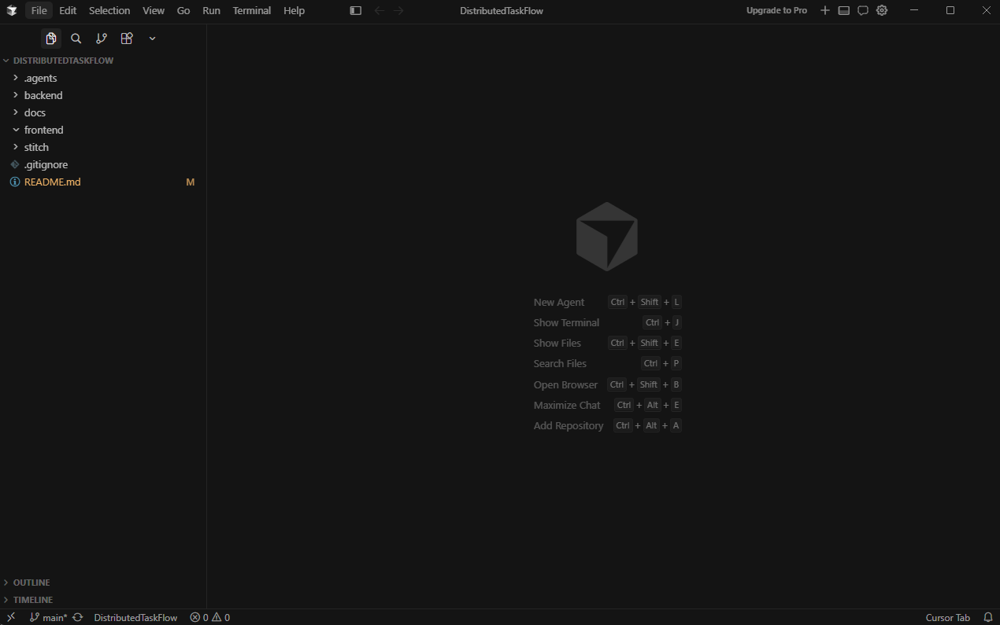
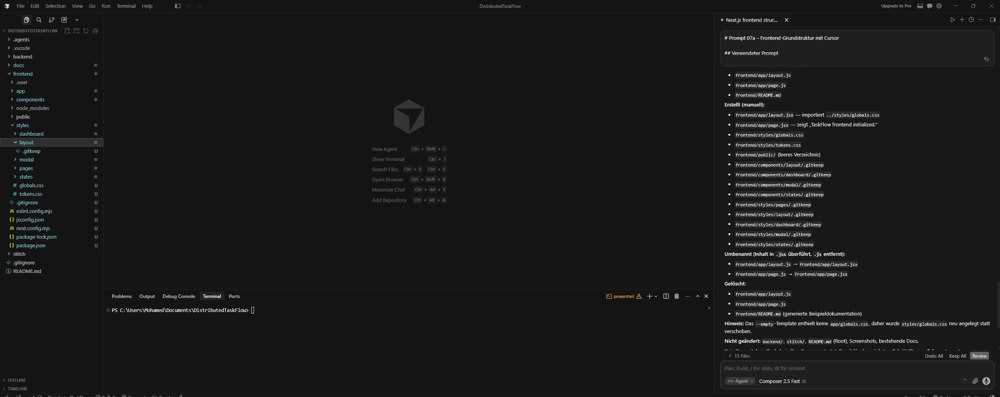

# Schritt 07a – Next.js-Grundstruktur mit Cursor

## Ziel

In diesem Schritt wurde die technische Grundstruktur des Frontends für **DistributedTaskFlow** erstellt.

Dafür wurde **Cursor** als Visual-Studio-Code-Clone praktisch eingesetzt. Damit wird zusätzlich zum bereits verwendeten CLI-Werkzeug eine zweite Werkzeugart aus der Aufgabenstellung nachgewiesen.

Der Schwerpunkt dieses Schritts lag ausschließlich auf:

- Initialisierung eines Next.js-Projekts
- Verwendung von React mit JavaScript und JSX
- Einrichtung des App Routers
- Vorbereitung einer klaren Komponentenstruktur
- Vorbereitung der CSS- und CSS-Modules-Struktur
- Einrichtung von ESLint
- Prüfung der erzeugten Anwendung durch einen Production-Build

Das Google-Stitch-Design wurde in diesem Schritt noch nicht analysiert oder umgesetzt.

---

## Verwendete Werkzeuge und Technologien

- Cursor Editor
- Cursor Agent
- Next.js
- React
- JavaScript
- JSX
- App Router
- npm
- ESLint
- Plain CSS
- CSS Modules

Bewusst nicht verwendet wurden:

- TypeScript
- Tailwind CSS
- zusätzliche UI-Bibliotheken
- State-Management-Bibliotheken

---

## Verwendeter Prompt

Der vollständige Prompt für Cursor Agent ist im Repository gespeichert:

- [Prompt 07a – Next.js-Grundstruktur mit Cursor](../prompts/07a-cursor-frontend-structure.md)

Der Prompt definierte unter anderem:

- das bestehende Verzeichnis `frontend/` als Ziel
- JavaScript und JSX als Programmiersprache
- den Next.js App Router
- die vorgesehene Komponentenstruktur
- die Trennung von Komponenten und Styles
- den Verzicht auf TypeScript und Tailwind
- die abschließende Build-Prüfung

---

## Ausgangslage

Vor diesem Schritt war das Backend bereits vollständig vorbereitet.

Vorhanden waren:

- Task API
- SQLite-Persistenz
- Analytics API
- verteilte HTTP-Kommunikation
- Swagger UI für beide APIs

Das Frontend-Verzeichnis war für die spätere Next.js-Anwendung vorgesehen, enthielt jedoch noch keine vollständige technische Grundstruktur.

Die Google-Stitch-Ausgaben waren ebenfalls bereits vorhanden, wurden in diesem Schritt aber bewusst noch nicht analysiert oder in React übertragen.

---

## Warum Cursor verwendet wurde

Die Aufgabenstellung verlangte die Verwendung eines CLI-Werkzeugs oder eines Visual-Studio-Code-Clones sowie einen Nachweis über die praktische Nutzung der jeweils anderen Werkzeugart.

Im Projekt wurden deshalb folgende Werkzeuge eingesetzt:

| Werkzeugart | Werkzeug | Verwendung |
| --- | --- | --- |
| CLI-Werkzeug | Codex CLI | Planung, Backend-Entwicklung und spätere Frontend-Arbeiten |
| Visual-Studio-Code-Clone | Cursor | Erstellung der Next.js-Grundstruktur |

Cursor wurde nicht nur installiert, sondern praktisch verwendet:

1. Das Repository wurde im Cursor Editor geöffnet.
2. Cursor erkannte die bestehende Projektstruktur.
3. Der Cursor Agent erhielt einen klar abgegrenzten Prompt.
4. Der Agent erstellte die Frontend-Grundstruktur im vorhandenen Verzeichnis.
5. Die erzeugten Dateien wurden im Cursor Editor überprüft.
6. Der Production-Build wurde ausgeführt.

---

## Durchführung

### 1. Repository im Cursor Editor öffnen

Das vollständige Repository wurde im Cursor Editor geöffnet.

Dadurch konnte Cursor auf die bereits vorhandenen Verzeichnisse zugreifen:

```text
backend/
docs/
frontend/
stitch/
```

Der vorhandene Ordner `frontend/` wurde als Zielverzeichnis für die Next.js-Anwendung verwendet.

Es wurde kein zusätzliches verschachteltes Verzeichnis wie:

```text
frontend/frontend/
```

erstellt.

---

### 2. Cursor Agent starten

Im Cursor Editor wurde der Agent geöffnet und der gespeicherte Prompt übergeben.

Der Prompt beschränkte den Agenten auf die technische Initialisierung.

Nicht Bestandteil des Auftrags waren:

- Analyse der Stitch-Ausgaben
- Umsetzung des Dashboards
- Erstellung fertiger UI-Komponenten
- Verbindung mit dem Backend
- Änderung der Backend-Projekte

Dadurch blieb Schritt 07a klar von den folgenden Frontend-Schritten getrennt.

---

### 3. Next.js-Projekt initialisieren

Im vorhandenen Verzeichnis `frontend/` wurde eine Next.js-Anwendung vorbereitet.

Verwendet wurden:

```text
Next.js
React
JavaScript
JSX
App Router
```

Die zentralen Einstiegspunkte wurden als JSX-Dateien erstellt:

```text
frontend/app/layout.jsx
frontend/app/page.jsx
```

Die Startseite enthielt zunächst nur einen einfachen technischen Platzhalter:

```text
TaskFlow frontend initialized.
```

Damit konnte geprüft werden, ob das Projekt korrekt startet und rendert.

---

### 4. Projektkonfiguration erstellen

Für das Frontend wurden die notwendigen Konfigurationsdateien angelegt.

Dazu gehören:

- npm-Projektkonfiguration
- Abhängigkeitssperrdatei
- Next.js-Konfiguration
- JavaScript-Konfiguration
- Import-Aliase
- ESLint-Konfiguration

Die Konfiguration wurde auf ein JavaScript- und JSX-Projekt ohne TypeScript ausgerichtet.

---

### 5. Komponentenstruktur vorbereiten

Für die spätere Frontend-Implementierung wurden getrennte Komponentenbereiche vorbereitet:

```text
frontend/components/
├── dashboard/
├── layout/
├── modal/
└── states/
```

Die Verzeichnisse wurden nach ihrer späteren Verantwortung getrennt.

| Verzeichnis | Geplanter Inhalt |
| --- | --- |
| `layout/` | übergreifende Layout-Komponenten |
| `dashboard/` | Dashboard- und Aufgabenkomponenten |
| `modal/` | Dialoge zum Erstellen und Bearbeiten von Aufgaben |
| `states/` | Loading-, Empty- und Error-Zustände |

Zu diesem Zeitpunkt enthielten diese Verzeichnisse noch keine fertigen React-Komponenten.

Leere Verzeichnisse wurden vorübergehend durch `.gitkeep`-Dateien sichtbar gehalten.

Diese Platzhalter wurden in einem späteren Implementierungsschritt entfernt, sobald echte Komponenten erstellt wurden.

---

### 6. Stylestruktur vorbereiten

Auch die Styles wurden nach Funktionsbereichen aufgeteilt:

```text
frontend/styles/
├── dashboard/
├── layout/
├── modal/
├── pages/
├── states/
├── globals.css
└── tokens.css
```

Die Datei `globals.css` wurde für globale Basisregeln vorbereitet.

Die Datei `tokens.css` wurde für zentrale Designwerte vorbereitet, beispielsweise:

- Farben
- Abstände
- Radien
- Schatten
- Schriftgrößen

Die eigentlichen Designwerte aus Google Stitch wurden erst nach der späteren Stitch-Analyse übernommen.

---

## Struktur nach diesem Schritt

Zum Zeitpunkt des Abschlusses von Schritt 07a bestand die vorbereitete Struktur aus:

```text
frontend/
├── app/
│   ├── layout.jsx
│   └── page.jsx
├── components/
│   ├── dashboard/
│   │   └── .gitkeep
│   ├── layout/
│   │   └── .gitkeep
│   ├── modal/
│   │   └── .gitkeep
│   └── states/
│       └── .gitkeep
├── public/
├── styles/
│   ├── dashboard/
│   │   └── .gitkeep
│   ├── layout/
│   │   └── .gitkeep
│   ├── modal/
│   │   └── .gitkeep
│   ├── pages/
│   │   └── .gitkeep
│   ├── states/
│   │   └── .gitkeep
│   ├── globals.css
│   └── tokens.css
├── eslint.config.mjs
├── jsconfig.json
├── next.config.mjs
├── package.json
└── package-lock.json
```

Die `.gitkeep`-Dateien dokumentieren den Zustand dieses Schritts. Einige davon sind im aktuellen Projektstand nicht mehr vorhanden, weil sie später durch echte Komponenten und CSS-Module ersetzt wurden.

---

## Zugehörige Dateien

### App Router

- [`layout.jsx`](../../frontend/app/layout.jsx)
- [`page.jsx`](../../frontend/app/page.jsx)

### Globale Styles

- [`globals.css`](../../frontend/styles/globals.css)
- [`tokens.css`](../../frontend/styles/tokens.css)

### Projektkonfiguration

- [`package.json`](../../frontend/package.json)
- [`package-lock.json`](../../frontend/package-lock.json)
- [`next.config.mjs`](../../frontend/next.config.mjs)
- [`jsconfig.json`](../../frontend/jsconfig.json)
- [`eslint.config.mjs`](../../frontend/eslint.config.mjs)

Die aktuellen Inhalte einzelner Dateien können durch spätere Entwicklungsschritte erweitert oder verändert worden sein. Die Dateien wurden jedoch in diesem Schritt erstmals als technische Frontend-Grundlage erstellt.

---

## Screenshots

### Repository im Cursor Editor

- [Screenshot öffnen](../screenshots/cursor/cursor-01-project-open.png)



Der Screenshot dokumentiert:

- das im Cursor Editor geöffnete Repository
- die vorhandene Projektstruktur
- die praktische Verwendung von Cursor
- den Zugriff auf das Verzeichnis `frontend/`

---

### Ergebnis der Frontend-Initialisierung

- [Screenshot öffnen](../screenshots/cursor/cursor-07a-frontend-structure-result.png)



Der Screenshot dokumentiert:

- die Verwendung von Cursor Agent
- die Erstellung der Next.js-Grundstruktur
- die angelegten Konfigurationsdateien
- die vorbereiteten Komponenten- und Styleverzeichnisse
- das Ergebnis des abgegrenzten Agent-Auftrags

---

## Build-Prüfung

Nach der Initialisierung wurde geprüft, ob das neue Frontend technisch gültig ist.

Ausgeführt im Verzeichnis:

```text
frontend/
```

Verwendeter Befehl:

```powershell
npm.cmd run build
```

Der Production-Build prüfte unter anderem:

- gültige Next.js-Konfiguration
- gültige JSX-Syntax
- auflösbare Imports
- vorhandene Abhängigkeiten
- App-Router-Struktur
- Erstellung eines produktionsfähigen Builds

Der Build wurde erfolgreich abgeschlossen.

Damit war bestätigt, dass die technische Frontend-Grundlage korrekt eingerichtet wurde.

---

## Abgrenzung dieses Schritts

In Schritt 07a wurden bewusst noch keine fachlichen oder visuellen Funktionen umgesetzt.

Nicht Bestandteil dieses Schritts waren:

- Analyse der Stitch-Dateien
- Übernahme von Farben und Design-Tokens aus Stitch
- Umsetzung des Dashboard-Layouts
- Header
- Sidebar
- Statistik-Karten
- Fortschrittsanzeige
- Aufgaben-Toolbar
- Aufgabenliste
- Aufgaben-Karten
- Add-Task-Modal
- Empty State
- Loading State
- Statistics Error State
- responsive Detailumsetzung
- API-Schicht
- Laden echter Aufgaben
- CRUD-Funktionen
- Kommunikation mit der Task API
- Kommunikation mit der Analytics API

Diese Arbeiten wurden bewusst auf nachfolgende Schritte verteilt.

---

## Nachweis

Die praktische Verwendung von Cursor wird durch folgende Elemente belegt:

- gespeicherter Cursor-Prompt
- Screenshot des geöffneten Repositories
- Screenshot des Cursor-Agent-Ergebnisses
- mit Cursor erzeugte Next.js-Dateien
- vorbereitete Komponentenstruktur
- vorbereitete Stylestruktur
- erfolgreicher Production-Build

Damit ist die Nutzung eines Visual-Studio-Code-Clones nachvollziehbar dokumentiert.

---

## Ergebnis

Am Ende dieses Schritts war eine funktionsfähige Next.js-Grundstruktur vorhanden.

Erstellt und vorbereitet wurden:

- Next.js mit App Router
- React mit JavaScript und JSX
- Root Layout
- technische Startseite
- npm-Konfiguration
- Next.js-Konfiguration
- JavaScript- und Alias-Konfiguration
- ESLint
- Komponentenverzeichnisse
- Stylesverzeichnisse
- globale Styles
- Design-Token-Datei
- Production-Build

Die Startseite zeigte zu diesem Zeitpunkt ausschließlich:

```text
TaskFlow frontend initialized.
```

Das Google-Stitch-Design, die React-Komponenten und die Backend-Integration wurden noch nicht umgesetzt.

Damit war die technische Grundlage für die anschließende Analyse und Implementierung des Frontends geschaffen.