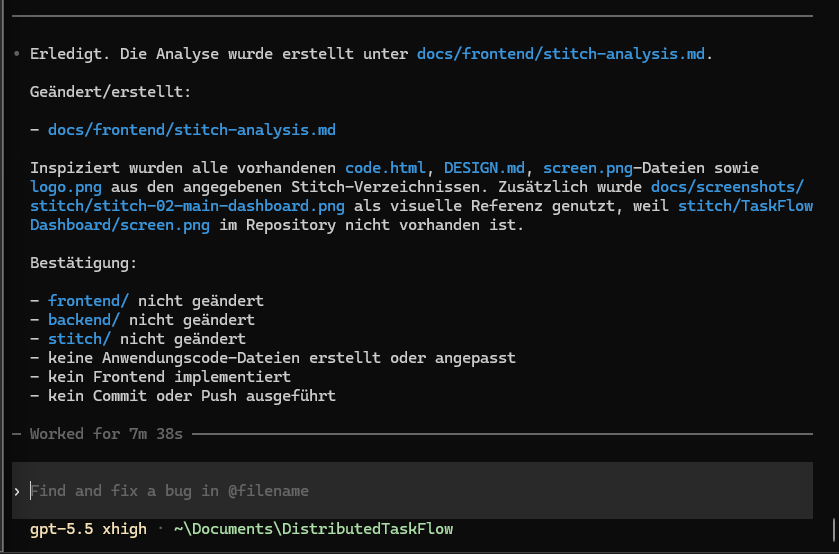

# Schritt 07b – Analyse der Google-Stitch-Dateien mit Codex CLI

## Ziel

In diesem Schritt wurden sämtliche vorhandenen Google-Stitch-Ausgaben mit **Codex CLI** vollständig analysiert.

Ziel war es, vor Beginn der eigentlichen Frontend-Implementierung ein klares technisches Verständnis für:

- die gemeinsame Seitenstruktur
- die unterschiedlichen UI-Zustände
- wiederverwendbare React-Komponenten
- Design-Tokens
- responsive Layoutregeln
- Interaktionen
- Animationen
- externe Abhängigkeiten
- mögliche Inkonsistenzen zwischen den Exporten

zu entwickeln.

Die einzelnen Stitch-Screens sollten dabei nicht als voneinander unabhängige Webseiten verstanden werden.

Stattdessen wurde geprüft, wie sie als unterschiedliche Zustände einer gemeinsamen TaskFlow-Dashboard-Anwendung umgesetzt werden können.

In diesem Schritt wurde bewusst noch kein produktiver Frontend-Code geschrieben oder verändert.

---

## Verwendete Werkzeuge und Technologien

- Codex CLI
- Google-Stitch-Exporte
- HTML
- Markdown
- visuelle Bildanalyse
- React-Komponentenplanung
- CSS- und Design-Token-Analyse

---

## Verwendeter Prompt

Der vollständige Prompt dieses Analyseschritts ist im Repository gespeichert:

- [Prompt 07b – Analyse der Google-Stitch-Dateien mit Codex CLI](../prompts/07b-codex-stitch-analysis.md)

Der Prompt definierte unter anderem:

- die vollständige Prüfung aller Stitch-Verzeichnisse
- die Analyse von `code.html`, `DESIGN.md` und Bilddateien
- die Erkennung gemeinsamer Layoutbereiche
- die Planung wiederverwendbarer React-Komponenten
- die Übertragung von Tailwind-Strukturen in JSX und CSS Modules
- die Dokumentation von Design-Tokens
- die Analyse des Responsive-Verhaltens
- die Erkennung von Inkonsistenzen
- die Erstellung eines vollständigen Analyseberichts
- das ausdrückliche Verbot, in diesem Schritt Anwendungscode zu verändern

---

## Ausgangslage

Vor diesem Schritt war bereits eine technische Next.js-Grundstruktur vorhanden.

Vorbereitet waren unter anderem:

```text
frontend/app/
frontend/components/
frontend/styles/
frontend/public/
```

Die Ordner enthielten jedoch noch keine vollständig umgesetzten Dashboard-Komponenten.

Gleichzeitig lagen die ursprünglichen Google-Stitch-Exporte vor:

- TaskFlow Dashboard
- Add Task Modal
- Empty State Dashboard
- Loading State Dashboard
- Statistics Error State
- TaskFlow Logo

Die Aufgabe dieses Schritts bestand darin, diese Ausgaben systematisch auszuwerten und eine klare Umsetzungsgrundlage für React zu erstellen.

---

## Durchführung

Die Analyse wurde in mehreren aufeinanderfolgenden Phasen durchgeführt.

### 1. Stitch-Verzeichnisse erfassen

Zunächst wurden alle vorhandenen Verzeichnisse unter:

```text
stitch/
```

ermittelt und den jeweiligen UI-Zuständen zugeordnet.

Geprüft wurden:

```text
stitch/TaskFlow Dashboard/
stitch/Add Task Modal/
stitch/Empty State Dashboard/
stitch/Loading State Dashboard/
stitch/Statistics Error State/
stitch/TaskFlow Logo/
```

---

### 2. HTML-Exporte vollständig lesen

Alle vorhandenen Dateien mit dem Namen:

```text
code.html
```

wurden vollständig analysiert.

Dabei wurden unter anderem geprüft:

- HTML-Struktur
- Tailwind-Klassen
- eingebettete Styles
- eingebettete Konfigurationen
- Layoutcontainer
- wiederholte Seitenbereiche
- Buttons
- Formulare
- Icons
- visuelle Zustände
- responsives Verhalten
- Demo-JavaScript
- externe Fonts und Assets

Die generierten HTML-Dateien wurden nicht als produktionsfertiger React-Code betrachtet.

Sie dienten als technische und visuelle Referenz.

---

### 3. Designbeschreibungen analysieren

Alle vorhandenen Dateien mit dem Namen:

```text
DESIGN.md
```

wurden vollständig gelesen.

Dokumentiert und verglichen wurden unter anderem:

- Farbwerte
- Typografie
- Schriftgrößen
- Schriftgewichte
- Abstände
- Radien
- Schatten
- Kartenstile
- Buttonstile
- Layoutbreiten
- Responsive-Regeln
- Hover-Zustände
- Fokuszustände
- Animationen

---

### 4. Screens und Assets visuell prüfen

Alle verfügbaren Bilddateien wurden visuell analysiert.

Dazu gehörten:

- `screen.png`
- `logo.png`
- die zusätzlich unter `docs/screenshots/stitch/` gespeicherten Nachweise

Die Bilder wurden mit den jeweiligen HTML- und Design-Dateien verglichen.

Dadurch konnten Unterschiede zwischen:

- beschriebenem Design
- generiertem HTML
- tatsächlich sichtbarem Ergebnis

erkannt werden.

---

### 5. Screens miteinander vergleichen

Anschließend wurden die verschiedenen Stitch-Exporte miteinander verglichen.

Dabei wurde geprüft:

- welche Bereiche in allen Screens identisch sind
- welche Inhalte nur zustandsabhängig erscheinen
- welche Layoutteile wiederverwendet werden können
- welche Screens dieselbe Dashboard-Struktur duplizieren
- welche Komponenten gemeinsam genutzt werden sollten
- welche Unterschiede durch React-State dargestellt werden können

---

### 6. React-Komponentenplan erstellen

Aus den gemeinsamen und variablen Bereichen wurde eine Komponentenstruktur für die spätere Next.js-Implementierung abgeleitet.

Dabei wurde vermieden, für jeden Stitch-Screen eine vollständige eigene Seite zu erstellen.

Stattdessen wurde ein gemeinsames Dashboard mit zustandsabhängigen Komponenten geplant.

---

### 7. CSS- und Token-Struktur planen

Die generierten Tailwind-Klassen sollten nicht direkt in das endgültige Projekt übernommen werden.

Deshalb wurde geplant:

- Tailwind-Klassen in CSS Modules zu übertragen
- globale Designwerte in `tokens.css` zu definieren
- globale Basisregeln in `globals.css` zu speichern
- für jede React-Komponente ein eigenes CSS Module zu verwenden
- responsive Regeln in den jeweils zuständigen Styledateien abzulegen

---

### 8. Implementierungsreihenfolge festlegen

Abschließend wurde eine empfohlene Reihenfolge für die Frontend-Umsetzung dokumentiert.

Dadurch konnte die spätere Implementierung strukturiert erfolgen, ohne gleichzeitig Design, Komponentenstruktur und Zustandssystem neu entscheiden zu müssen.

---

# Analysierte Stitch-Ausgaben

## TaskFlow Dashboard

Das Hauptdashboard wurde als kanonische Quelle für die gemeinsame Anwendungsstruktur verwendet.

Analysierte Dateien:

- [HTML-Export](../../stitch/TaskFlow%20Dashboard/code.html)
- [Designbeschreibung](../../stitch/TaskFlow%20Dashboard/DESIGN.md)
- [Originaler Screen](../../stitch/TaskFlow%20Dashboard/screen.png)

Zusätzlicher dokumentierter Screenshot:

- [TaskFlow-Hauptdashboard](../screenshots/stitch/stitch-02-main-dashboard.png)

Aus diesem Screen wurden insbesondere folgende Bereiche abgeleitet:

- Header
- Sidebar
- Dashboard-Titel
- Statistikbereich
- Fortschrittsanzeige
- Aufgabenfilter
- Aufgabenliste
- Desktop-Add-Task-Button
- mobile Add-Task-Aktion

---

## Add Task Modal

Dieser Export beschreibt den Dialog zum Erstellen einer neuen Aufgabe.

Analysierte Dateien:

- [HTML-Export](../../stitch/Add%20Task%20Modal/code.html)
- [Designbeschreibung](../../stitch/Add%20Task%20Modal/DESIGN.md)
- [Originaler Screen](../../stitch/Add%20Task%20Modal/screen.png)

Analysierte Bereiche:

- Modal-Overlay
- Dialogcontainer
- Titel-Eingabefeld
- Prioritätsauswahl
- Datumsfeld
- Close-Button
- Cancel-Button
- Save-Button
- Fokus- und Hoverzustände

---

## Empty State Dashboard

Dieser Export beschreibt den Zustand ohne vorhandene oder passende Aufgaben.

Analysierte Dateien:

- [HTML-Export](../../stitch/Empty%20State%20Dashboard/code.html)
- [Designbeschreibung](../../stitch/Empty%20State%20Dashboard/DESIGN.md)
- [Originaler Screen](../../stitch/Empty%20State%20Dashboard/screen.png)

Analysierte Bereiche:

- Empty-State-Illustration
- erklärender Text
- Create-Task-Aktion
- weiterhin sichtbare Dashboard-Struktur
- leere Aufgabenliste
- Statistikzustand ohne vorhandene Aufgaben

---

## Loading State Dashboard

Dieser Export beschreibt den Zustand während des Ladens von Aufgaben und Statistiken.

Analysierte Dateien:

- [HTML-Export](../../stitch/Loading%20State%20Dashboard/code.html)
- [Designbeschreibung](../../stitch/Loading%20State%20Dashboard/DESIGN.md)
- [Originaler Screen](../../stitch/Loading%20State%20Dashboard/screen.png)

Analysierte Bereiche:

- Statistik-Skeletons
- Aufgaben-Skeletons
- Shimmer-Animation
- Ladehinweise
- weiterhin erkennbare Dashboard-Struktur

---

## Statistics Error State

Dieser Export beschreibt den Zustand bei nicht verfügbaren Statistikdaten.

Analysierte Dateien:

- [HTML-Export](../../stitch/Statistics%20Error%20State/code.html)
- [Designbeschreibung](../../stitch/Statistics%20Error%20State/DESIGN.md)
- [Originaler Screen](../../stitch/Statistics%20Error%20State/screen.png)

Analysierte Bereiche:

- Fehlermeldung
- Retry-Button
- nicht verfügbare Statistikbereiche
- weiterhin nutzbare Aufgabenverwaltung
- visuelle Trennung zwischen Statistikfehler und Aufgabenliste

---

## TaskFlow Logo

Das Logo wurde als lokales Asset für die spätere Frontend-Implementierung analysiert.

Analysierte Dateien:

- [Designbeschreibung](../../stitch/TaskFlow%20Logo/DESIGN.md)
- [Logo-Asset](../../stitch/TaskFlow%20Logo/logo.png)

Analysiert wurden:

- Logoform
- Icon
- Wortmarke
- Farben
- transparente Bereiche
- mögliche Verwendung in Header und Sidebar

---

# Wichtigste Analyseergebnisse

## Eine gemeinsame Dashboard-Anwendung

Die Stitch-Ausgaben stellen keine voneinander unabhängigen Next.js-Seiten dar.

Sie repräsentieren unterschiedliche Zustände derselben Anwendung:

```text
TaskFlow Dashboard
├── Standardzustand
├── Add-Task-Modal geöffnet
├── Empty State
├── Loading State
└── Statistics Error State
```

Deshalb wurde entschieden, nicht für jeden Zustand eine eigene Route oder vollständige Seite anzulegen.

Stattdessen sollte eine gemeinsame Dashboard-Seite verwendet werden, die abhängig vom React-State unterschiedliche Komponenten anzeigt.

---

## Das Hauptdashboard als kanonische Grundlage

Das Verzeichnis:

```text
stitch/TaskFlow Dashboard/
```

wurde als primäre Quelle für die gemeinsame Struktur festgelegt.

Andere Screens sollten nur die jeweils abweichenden Zustände ergänzen.

Dadurch wird verhindert, dass:

- Header mehrfach implementiert werden
- Sidebar mehrfach implementiert wird
- Statistikbereiche dupliziert werden
- verschiedene Screens unterschiedliche Layoutvarianten erzeugen
- vollständige HTML-Seiten kopiert werden

---

## Gemeinsame Layout-Komponenten

Folgende Komponenten wurden als gemeinsame Layoutstruktur identifiziert:

```text
DashboardLayout
Header
Sidebar
```

### `DashboardLayout`

Verantwortung:

- gemeinsame Seitenstruktur
- Sidebar- und Content-Aufteilung
- Hauptcontainer
- responsives Layout

### `Header`

Verantwortung:

- Logo
- Desktop- oder mobile Navigation
- globales Suchfeld
- Benutzer- oder Aktionsbereich

### `Sidebar`

Verantwortung:

- TaskFlow-Branding
- Navigation
- Desktop-Seitenstruktur
- aktiver Navigationszustand

---

## Dashboard-Komponenten

Folgende wiederverwendbare Dashboard-Komponenten wurden geplant:

```text
DashboardHeader
StatisticsPanel
StatisticCard
ProgressCard
TaskToolbar
TaskList
TaskCard
MobileAddButton
```

### `DashboardHeader`

Enthält:

- Seitentitel
- Beschreibung
- Desktop-Add-Task-Button

### `StatisticsPanel`

Verantwortung:

- Gruppierung der Statistik-Karten
- Darstellung von Lade-, Erfolgs- und Fehlerzuständen

### `StatisticCard`

Wiederverwendbare Darstellung einzelner Statistikwerte:

- Gesamtzahl
- offen
- erledigt
- überfällig

### `ProgressCard`

Darstellung von:

- Abschlussquote
- Fortschrittsbalken
- optionalem Weighted Open Score

### `TaskToolbar`

Enthält ausschließlich:

- Statusfilter
- Strategieauswahl

Die zentrale Titelsuche bleibt im Header.

Dadurch wird vermieden, dass dieselbe Suche an mehreren Stellen der Oberfläche erscheint.

### `TaskList`

Verantwortung:

- Aufgabenliste darstellen
- Empty State anzeigen
- Loading State anzeigen
- Aufgaben an `TaskCard` übergeben

### `TaskCard`

Verantwortung:

- Titel
- Priorität
- Fälligkeitsdatum
- Abschlussstatus
- Edit-Aktion
- Delete-Aktion
- Toggle-Aktion

### `MobileAddButton`

Zusätzliche Add-Task-Aktion für kleinere Bildschirmgrößen.

---

## Zustandsabhängige Komponenten

Folgende Komponenten werden nur in bestimmten Zuständen gerendert:

```text
TaskModal
EmptyState
LoadingState
StatisticsError
```

### `TaskModal`

Wird angezeigt, wenn eine Aufgabe erstellt oder bearbeitet wird.

### `EmptyState`

Wird angezeigt, wenn:

- noch keine Aufgaben existieren
- oder keine Aufgaben zum aktuellen Filter passen

### `LoadingState`

Wird ausschließlich während aktiver Ladeprozesse dargestellt.

### `StatisticsError`

Wird angezeigt, wenn die Statistikberechnung nicht verfügbar ist.

Die Aufgabenverwaltung soll in diesem Zustand weiterhin nutzbar bleiben.

---

# Geplante React-Komponentenstruktur

Die empfohlene Struktur lautete:

```text
frontend/components/
├── layout/
│   ├── DashboardLayout.jsx
│   ├── Header.jsx
│   └── Sidebar.jsx
├── dashboard/
│   ├── DashboardHeader.jsx
│   ├── StatisticsPanel.jsx
│   ├── StatisticCard.jsx
│   ├── ProgressCard.jsx
│   ├── TaskToolbar.jsx
│   ├── TaskList.jsx
│   ├── TaskCard.jsx
│   └── MobileAddButton.jsx
├── modal/
│   └── TaskModal.jsx
└── states/
    ├── EmptyState.jsx
    ├── LoadingState.jsx
    └── StatisticsError.jsx
```

Die vollständige Zuordnung zwischen:

- Stitch-Quelle
- React-Komponente
- erwarteten Props
- Interaktionen
- CSS-Modul

befindet sich im vollständigen Analysebericht.

---

# Styling-Entscheidung

## Keine direkte Tailwind-Übernahme

Die Stitch-Exporte verwendeten teilweise umfangreiche Tailwind-Klassen und eingebettete Konfigurationen.

Diese sollten nicht direkt übernommen werden.

Gründe:

- sehr lange JSX-Klassen
- wiederholte Utility-Kombinationen
- schlechtere Lesbarkeit
- unnötige Abhängigkeit von Tailwind
- bereits geplante Verwendung von Plain CSS
- klare Trennung zwischen Komponenten und Styles

Die endgültige Umsetzung sollte deshalb erfolgen mit:

```text
JSX
CSS Modules
globals.css
tokens.css
```

---

## CSS-Module

Für jede größere Komponente wurde ein eigenes CSS Module vorgesehen.

Beispiel:

```text
DashboardHeader.jsx
DashboardHeader.module.css
```

Dadurch bleiben:

- Styles lokal
- Klassennamen konfliktfrei
- Komponenten übersichtlich
- Layoutregeln klar zugeordnet

---

## Globale Styles

Globale Basisregeln sollten in folgender Datei gespeichert werden:

- [`globals.css`](../../frontend/styles/globals.css)

Geplante Inhalte:

- CSS-Reset
- `box-sizing`
- Body-Grundstil
- globale Schrift
- Button- und Input-Basisregeln
- Accessibility-Grundlagen

---

## Design-Tokens

Zentrale Designwerte sollten in folgender Datei gespeichert werden:

- [`tokens.css`](../../frontend/styles/tokens.css)

Geplante Token-Gruppen:

- Primary Colors
- Neutral Colors
- Success Colors
- Warning Colors
- Error Colors
- Text Colors
- Background Colors
- Border Colors
- Spacing
- Border Radius
- Shadows
- Transitions
- Font Sizes

Als zentrale Primärfarben wurden unter anderem Werte aus den Stitch-Ausgaben vereinheitlicht.

Die vollständige Tokenliste befindet sich im Analysebericht:

- [Vollständige Google-Stitch-Analyse](../frontend/stitch-analysis.md)

---

# Responsive Verhalten

Aus den Stitch-Dateien wurden folgende zentrale Bereiche abgeleitet:

| Bereich | Breite |
| --- | --- |
| Mobile | unter `768px` |
| Tablet | `768px` bis `1023px` |
| Desktop | ab `1024px` |
| großer Desktop | ab `1280px` |

---

## Mobile

Für kleine Bildschirmgrößen wurde geplant:

- Sidebar ausblenden
- kompakten Header verwenden
- Statistik-Karten untereinander oder in kleinerem Grid darstellen
- Aufgaben-Karten vertikal strukturieren
- mobile Add-Task-Aktion anzeigen
- Modalbreite an den Viewport anpassen
- Filter horizontal scrollbar oder kompakt darstellen

---

## Tablet

Für mittlere Bildschirmgrößen wurde geplant:

- noch keine feste Sidebar
- breiterer Hauptinhalt
- Statistik-Karten in mehreren Spalten
- Desktop- und Mobile-Elemente abhängig vom verfügbaren Platz kombinieren

---

## Desktop

Ab `1024px` wurde geplant:

- Sidebar anzeigen
- vollständigen Desktop-Header verwenden
- Statistik-Karten in einer Reihe darstellen
- Aufgaben-Karten horizontal strukturieren
- Desktop-Add-Task-Button anzeigen
- mobile Add-Task-Aktion ausblenden

Die Sidebar sollte einheitlich erst ab `1024px` sichtbar sein.

Dadurch wurden abweichende Breakpoints aus einzelnen Stitch-Exporten vereinheitlicht.

---

# Analysierte Interaktionen

Folgende Benutzerinteraktionen wurden aus den Stitch-Screens abgeleitet:

- Add-Task-Modal öffnen
- Modal schließen
- Modal über Cancel schließen
- Aufgabe speichern
- Aufgabenstatus umschalten
- Aufgabe bearbeiten
- Aufgabe löschen
- Sucheingabe verwenden
- Statusfilter wechseln
- Statistikstrategie wechseln
- Statistik erneut laden
- Buttons über Hover hervorheben
- Inputs über Fokuszustände kennzeichnen

---

## Modalverhalten

Für das spätere Modal wurden folgende Anforderungen dokumentiert:

- Öffnen über Desktop-Add-Task-Button
- Öffnen über Mobile-Add-Task-Button
- Öffnen über Empty-State-Aktion
- Schließen über Close-Icon
- Schließen über Cancel
- Schließen über Escape
- Schließen beim Klick auf das Overlay
- kein Schließen beim Klick innerhalb des Dialogs

Diese funktionalen Details sollten später mit React umgesetzt werden.

---

## Animationen

Aus den Stitch-Dateien wurden unter anderem folgende Animationen beziehungsweise Übergänge abgeleitet:

- Shimmer für Loading-Skeletons
- sanfte Hover-Transitions
- Fokus-Transitions
- Modal-Einblendung
- Overlay-Einblendung
- Fortschrittsanimation

Die Animationen sollten mit Plain CSS umgesetzt werden.

---

# Externe Assets und Abhängigkeiten

Die Stitch-Exporte enthielten teilweise Referenzen auf:

- externe Fonts
- Icon-Bibliotheken
- Tailwind CDN
- eingebettete Konfigurationen
- entfernte Bildquellen

Für das endgültige Frontend wurde empfohlen:

- das TaskFlow-Logo lokal zu speichern
- keine Stitch-CDN-Abhängigkeit zu übernehmen
- keine externe Tailwind-Konfiguration zu verwenden
- Icons möglichst lokal oder über einfache React-Ausgaben umzusetzen
- externe Assets nur zu verwenden, wenn sie technisch notwendig sind

Das Logo sollte später übernommen werden als:

```text
frontend/public/taskflow-logo.png
```

---

# Erkannte Inkonsistenzen

Beim Vergleich der Stitch-Ausgaben wurden kleinere Unterschiede erkannt.

Dazu gehörten unter anderem:

- teilweise unterschiedliche Primary-Farben
- unterschiedliche Abstände zwischen einzelnen Screens
- abweichende Sidebar-Breakpoints
- unterschiedliche Buttongrößen
- teilweise doppelte Suchfelder
- unterschiedlich benannte UI-Bereiche
- wiederholte vollständige Dashboard-Strukturen
- Unterschiede zwischen HTML, `DESIGN.md` und sichtbarem Screen

Diese Unterschiede sollten nicht ungeprüft in das React-Frontend übernommen werden.

Stattdessen wurde eine gemeinsame konsistente Variante festgelegt.

---

## Vereinheitlichte Entscheidungen

Für die spätere Implementierung wurde empfohlen:

- das Hauptdashboard als kanonische Layoutquelle zu verwenden
- ein gemeinsames Suchfeld im Header zu verwenden
- `TaskToolbar` nur für Filter und Strategie zu nutzen
- die Sidebar ab `1024px` einzublenden
- gemeinsame Design-Tokens zu definieren
- einen einzigen `TaskModal` für Create und Edit zu verwenden
- einen gemeinsamen `TaskList`-Bereich für Loading, Empty und normale Aufgaben zu verwenden
- Statistikfehler getrennt von Aufgabenfehlern zu behandeln

---

# Empfohlene Implementierungsreihenfolge

Die Frontend-Umsetzung sollte in folgender Reihenfolge erfolgen:

1. globale Styles und Design-Tokens
2. Root Layout
3. DashboardLayout
4. Header
5. Sidebar
6. DashboardHeader
7. Statistik-Karten
8. ProgressCard
9. TaskToolbar
10. TaskCard
11. TaskList
12. Empty State
13. Loading State
14. Statistics Error State
15. TaskModal
16. MobileAddButton
17. responsive Detailanpassungen
18. Lint-Prüfung
19. Production-Build

Die API-Integration sollte erst nach Abschluss der visuellen Umsetzung erfolgen.

---

# Erstellte Datei

Das zentrale Ergebnis dieses Schritts ist der vollständige Analysebericht:

- [Vollständige Google-Stitch-Analyse](../frontend/stitch-analysis.md)

Der Bericht enthält:

- Inventar aller Stitch-Dateien
- Screenvergleich
- Komponentenplan
- Props-Vorschläge
- CSS-Modul-Zuordnung
- Design-Tokens
- Responsive-Regeln
- Interaktionen
- Animationen
- externe Abhängigkeiten
- Inkonsistenzen
- empfohlene Zielstruktur
- Implementierungsreihenfolge

---

# Screenshot

- [Codex CLI – Ergebnis der Stitch-Analyse öffnen](../screenshots/codex/codex-07b-stitch-analysis-result.png)



Der Screenshot dokumentiert:

- die praktische Verwendung von Codex CLI
- den Abschluss der Analyse
- die geprüften Stitch-Dateien
- die Erstellung des Analyseberichts
- die Bestätigung, dass kein Anwendungscode verändert wurde

---

# Nicht veränderte Bereiche

In diesem Schritt wurden keine produktiven Änderungen vorgenommen an:

```text
frontend/
backend/
stitch/
```

Die Stitch-Quelldateien blieben unverändert.

Die vorhandene Next.js-Grundstruktur wurde ebenfalls nicht verändert.

Erstellt beziehungsweise dokumentiert wurden ausschließlich:

- der Analysebericht
- die Schritt-Dokumentation
- der Screenshot als Nachweis

---

# Abgrenzung dieses Schritts

Folgende Funktionen wurden bewusst noch nicht umgesetzt:

- React-Komponenten
- CSS Modules
- Dashboard-Layout
- Sidebar
- Header
- Statistik-Karten
- Fortschrittsanzeige
- Aufgabenliste
- Aufgaben-Karten
- Add-Task-Modal
- Empty State
- Loading State
- Statistics Error State
- CRUD-Funktionalität
- API-Aufrufe
- Frontend-State-Management
- Backend-Integration

Dieser Schritt diente ausschließlich der Analyse und technischen Vorbereitung.

---

# Zugehörige Dateien

## Prompt

- [Prompt 07b – Stitch-Analyse](../prompts/07b-codex-stitch-analysis.md)

## Ergebnisdatei

- [Vollständige Google-Stitch-Analyse](../frontend/stitch-analysis.md)

## Screenshot

- [Codex CLI – Analyseergebnis](../screenshots/codex/codex-07b-stitch-analysis-result.png)

## Analysierte Quelldateien

- [TaskFlow Dashboard](../../stitch/TaskFlow%20Dashboard/)
- [Add Task Modal](../../stitch/Add%20Task%20Modal/)
- [Empty State Dashboard](../../stitch/Empty%20State%20Dashboard/)
- [Loading State Dashboard](../../stitch/Loading%20State%20Dashboard/)
- [Statistics Error State](../../stitch/Statistics%20Error%20State/)
- [TaskFlow Logo](../../stitch/TaskFlow%20Logo/)

---

# Ergebnis

Am Ende dieses Schritts lag eine vollständige technische Analyse sämtlicher Google-Stitch-Ausgaben vor.

Dokumentiert wurden:

- alle Stitch-Dateien
- alle UI-Zustände
- die gemeinsame Dashboard-Struktur
- wiederverwendbare React-Komponenten
- zustandsabhängige Komponenten
- Design-Tokens
- CSS-Struktur
- Responsive-Breakpoints
- Interaktionen
- Modalverhalten
- Animationen
- externe Abhängigkeiten
- Inkonsistenzen
- vereinheitlichte Designentscheidungen
- empfohlene Implementierungsreihenfolge

Es wurde kein produktiver Frontend-, Backend- oder Stitch-Code verändert.

Damit war eine klare und nachvollziehbare Grundlage für die anschließende React- und CSS-Implementierung geschaffen.