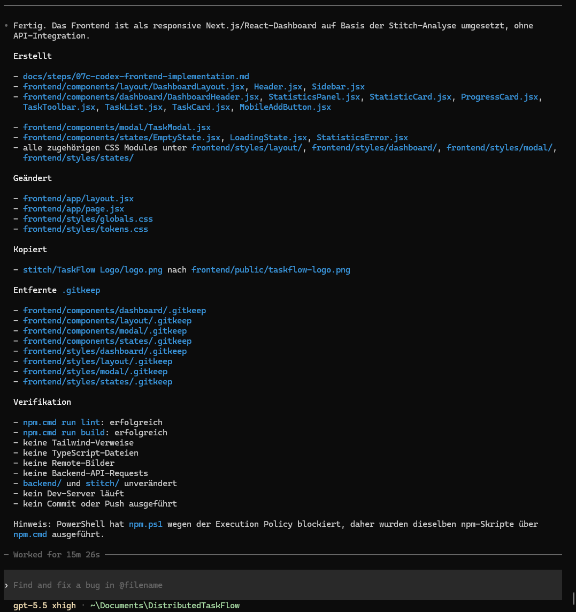

# Schritt 07c – Frontend-Implementierung mit Codex CLI

## Ziel

In diesem Schritt wurde das zuvor analysierte Google-Stitch-Design mit **Codex CLI** in ein strukturiertes Next.js- und React-Frontend übertragen.

Ziel war es, die statischen und teilweise mehrfach vorhandenen Stitch-Prototypen nicht direkt zu kopieren, sondern als eine gemeinsame responsive Dashboard-Anwendung umzusetzen.

Dabei sollten entstehen:

- wiederverwendbare React-Komponenten
- eine gemeinsame Layoutstruktur
- getrennte Komponenten für verschiedene UI-Zustände
- lokale CSS Modules
- zentrale Design-Tokens
- ein responsives Desktop- und Mobile-Layout
- eine technisch gültige Next.js-Anwendung

Das Frontend verwendete in diesem Schritt ausschließlich lokale Demonstrationsdaten.

Die Verbindung zur Task API und die produktiven CRUD-Funktionen waren noch nicht Bestandteil dieser Phase.

---

## Verwendete Werkzeuge und Technologien

- Codex CLI
- Next.js
- React
- JavaScript
- JSX
- App Router
- Plain CSS
- CSS Modules
- CSS Custom Properties
- Google Stitch als Designquelle
- npm
- ESLint

Bewusst nicht verwendet wurden:

- TypeScript
- Tailwind CSS
- externe UI-Bibliotheken
- externe State-Management-Bibliotheken
- Axios
- Remote-Bilder

---

## Verwendeter Prompt

Der vollständige Prompt dieses Implementierungsschritts ist im Repository gespeichert:

- [Prompt 07c – Frontend-Implementierung mit Codex CLI](../prompts/07c-codex-frontend-implementation.md)

Der Prompt definierte unter anderem:

- die vollständige Umsetzung des analysierten Stitch-Designs
- die Verwendung der vorhandenen Next.js-Grundstruktur
- die Aufteilung in kleine React-Komponenten
- die Verwendung von JavaScript und JSX
- die Umsetzung mit Plain CSS und CSS Modules
- den Verzicht auf Tailwind und TypeScript
- die lokale Übernahme des TaskFlow-Logos
- die Umsetzung mehrerer Dashboard-Zustände
- die Prüfung mit ESLint und Production-Build
- das Verbot, Backend- oder Stitch-Quelldateien zu verändern

---

## Verwendete Grundlagen

Für die Umsetzung wurden folgende vorhandene Quellen verwendet:

### Technische Analyse

- [Vollständige Google-Stitch-Analyse](../frontend/stitch-analysis.md)

Die Analyse enthielt:

- Komponentenplan
- Design-Tokens
- CSS-Modul-Zuordnung
- Responsive-Regeln
- Interaktionen
- Animationen
- erkannte Inkonsistenzen
- empfohlene Implementierungsreihenfolge

### Google-Stitch-Ausgaben

Als visuelle und technische Referenzen wurden verwendet:

- [TaskFlow Dashboard](../../stitch/TaskFlow%20Dashboard/)
- [Add Task Modal](../../stitch/Add%20Task%20Modal/)
- [Empty State Dashboard](../../stitch/Empty%20State%20Dashboard/)
- [Loading State Dashboard](../../stitch/Loading%20State%20Dashboard/)
- [Statistics Error State](../../stitch/Statistics%20Error%20State/)
- [TaskFlow Logo](../../stitch/TaskFlow%20Logo/)

Die Stitch-Dateien wurden in diesem Schritt ausschließlich gelesen.

Sie wurden nicht verändert.

---

## Ausgangslage

Vor diesem Schritt war bereits eine technische Next.js-Grundstruktur vorhanden.

Vorbereitet waren:

```text
frontend/app/
frontend/components/
frontend/styles/
frontend/public/
```

Die Komponenten- und Styleverzeichnisse enthielten jedoch noch keine vollständige Dashboard-Implementierung.

Die Startseite zeigte lediglich:

```text
TaskFlow frontend initialized.
```

Zusätzlich lag bereits eine detaillierte Analyse der Google-Stitch-Ausgaben vor.

Dadurch konnten Komponentenstruktur, Styling und Responsive-Verhalten umgesetzt werden, ohne diese Entscheidungen während des Programmierens erneut treffen zu müssen.

---

# Durchführung

## 1. Analysebericht vollständig lesen

Zu Beginn wurde die vorhandene Stitch-Analyse vollständig geprüft.

Besonders berücksichtigt wurden:

- gemeinsame Dashboard-Struktur
- wiederverwendbare Komponenten
- zustandsabhängige Komponenten
- Design-Tokens
- Responsive-Breakpoints
- Modalstruktur
- Loading State
- Empty State
- Statistics Error State
- geplante CSS-Module
- Implementierungsreihenfolge

Damit wurde sichergestellt, dass die React-Implementierung den zuvor dokumentierten Entscheidungen entspricht.

---

## 2. Stitch-Dateien als Referenz prüfen

Die relevanten Stitch-Dateien wurden erneut als visuelle Referenz betrachtet.

Geprüft wurden insbesondere:

- HTML-Strukturen
- Designbeschreibungen
- Screenshots
- Kartenlayouts
- Buttonstile
- Abstände
- Farben
- Schriftgrößen
- Sidebar
- Header
- Modaldarstellung
- mobile Darstellung

Die generierten HTML-Seiten wurden nicht direkt kopiert.

Stattdessen wurden ihre visuellen und strukturellen Eigenschaften in semantisches JSX und lokale CSS Modules übertragen.

---

## 3. Globale Design-Tokens umsetzen

Die zentralen Designwerte wurden in folgender Datei gebündelt:

- [`tokens.css`](../../frontend/styles/tokens.css)

Darin wurden unter anderem Variablen für folgende Bereiche vorbereitet beziehungsweise umgesetzt:

- Primärfarben
- neutrale Farben
- Hintergrundfarben
- Textfarben
- Borderfarben
- Erfolgsfarben
- Warnfarben
- Fehlerfarben
- Abstände
- Radien
- Schatten
- Transitionen
- Schriftgrößen

Beispielhafte Verwendung:

```css
var(--color-primary)
var(--color-text-primary)
var(--color-surface)
var(--radius-card)
var(--shadow-card)
```

Dadurch mussten wiederkehrende Designwerte nicht in mehreren CSS-Dateien dupliziert werden.

---

## 4. Globale Styles umsetzen

Globale Basisregeln wurden in folgender Datei definiert:

- [`globals.css`](../../frontend/styles/globals.css)

Die Datei enthält unter anderem:

- grundlegenden CSS-Reset
- `box-sizing`
- Body- und HTML-Regeln
- globale Typografie
- Basisdarstellung von Buttons
- Basisdarstellung von Formularfeldern
- Fokusregeln
- allgemeine Accessibility-Regeln

Die globalen Styles wurden im Root Layout eingebunden.

---

## 5. Root Layout anpassen

Das vorhandene Next.js Root Layout wurde für die tatsächliche Anwendung vorbereitet:

- [`layout.jsx`](../../frontend/app/layout.jsx)

Darin wurden unter anderem:

- globale Styles importiert
- Design-Tokens importiert
- Seitentitel beziehungsweise Metadaten vorbereitet
- die grundlegende HTML-Struktur definiert

Das Layout bildet die technische Hülle für das gesamte Frontend.

---

## 6. Gemeinsame Layout-Komponenten erstellen

Die wiederholten Shell-Strukturen der Stitch-Exporte wurden in gemeinsame React-Komponenten überführt.

Erstellt wurden:

```text
DashboardLayout
Header
Sidebar
```

Dadurch mussten Header, Sidebar und Hauptcontainer nicht für jeden Zustand neu implementiert werden.

---

# Layout-Komponenten

## `DashboardLayout`

Datei:

- [`DashboardLayout.jsx`](../../frontend/components/layout/DashboardLayout.jsx)

Style:

- [`DashboardLayout.module.css`](../../frontend/styles/layout/DashboardLayout.module.css)

Verantwortung:

- gemeinsame Seitenstruktur
- Sidebar- und Hauptbereich
- Content-Container
- responsive Anordnung
- zentrale Dashboard-Hülle

---

## `Header`

Datei:

- [`Header.jsx`](../../frontend/components/layout/Header.jsx)

Style:

- [`Header.module.css`](../../frontend/styles/layout/Header.module.css)

Verantwortung:

- obere Navigationsleiste
- Suchbereich
- mobile Darstellung
- Aktionen und visuelle Ausrichtung
- gemeinsame Header-Struktur

Das Suchfeld wurde zentral im Header vorgesehen.

Dadurch musste keine zusätzliche Suche in der Aufgaben-Toolbar dupliziert werden.

---

## `Sidebar`

Datei:

- [`Sidebar.jsx`](../../frontend/components/layout/Sidebar.jsx)

Style:

- [`Sidebar.module.css`](../../frontend/styles/layout/Sidebar.module.css)

Verantwortung:

- TaskFlow-Branding
- Navigation
- aktiver Menüpunkt
- Desktop-Seitenstruktur
- Anzeige des lokalen Logos

Die Sidebar wird abhängig von der verfügbaren Bildschirmbreite dargestellt.

---

# Dashboard-Komponenten

## `DashboardHeader`

Datei:

- [`DashboardHeader.jsx`](../../frontend/components/dashboard/DashboardHeader.jsx)

Style:

- [`DashboardHeader.module.css`](../../frontend/styles/dashboard/DashboardHeader.module.css)

Verantwortung:

- Dashboard-Titel
- kurze Beschreibung
- Desktop-Add-Task-Aktion

---

## `StatisticsPanel`

Datei:

- [`StatisticsPanel.jsx`](../../frontend/components/dashboard/StatisticsPanel.jsx)

Style:

- [`StatisticsPanel.module.css`](../../frontend/styles/dashboard/StatisticsPanel.module.css)

Verantwortung:

- Gruppierung der Statistik-Karten
- Darstellung mehrerer Statistikwerte
- Vorbereitung von Erfolgs-, Lade- und Fehlerzuständen

---

## `StatisticCard`

Datei:

- [`StatisticCard.jsx`](../../frontend/components/dashboard/StatisticCard.jsx)

Style:

- [`StatisticCard.module.css`](../../frontend/styles/dashboard/StatisticCard.module.css)

Die Komponente stellt einzelne Statistikwerte wiederverwendbar dar.

Beispiele:

- Total Tasks
- Open
- Completed
- Overdue

Dadurch musste nicht für jeden Wert eine eigene Kartenkomponente geschrieben werden.

---

## `ProgressCard`

Datei:

- [`ProgressCard.jsx`](../../frontend/components/dashboard/ProgressCard.jsx)

Style:

- [`ProgressCard.module.css`](../../frontend/styles/dashboard/ProgressCard.module.css)

Verantwortung:

- Abschlussquote anzeigen
- Fortschrittsbalken darstellen
- prozentualen Wert darstellen
- Bereich für den späteren Weighted Open Score vorbereiten

---

## `TaskToolbar`

Datei:

- [`TaskToolbar.jsx`](../../frontend/components/dashboard/TaskToolbar.jsx)

Style:

- [`TaskToolbar.module.css`](../../frontend/styles/dashboard/TaskToolbar.module.css)

Verantwortung:

- Statusfilter darstellen
- Strategieauswahl darstellen
- aktiven Filter visuell hervorheben

Die Toolbar enthält bewusst kein zweites Suchfeld.

Die Suche bleibt im Header.

---

## `TaskList`

Datei:

- [`TaskList.jsx`](../../frontend/components/dashboard/TaskList.jsx)

Style:

- [`TaskList.module.css`](../../frontend/styles/dashboard/TaskList.module.css)

Verantwortung:

- Aufgabenliste darstellen
- einzelne Aufgaben an `TaskCard` übergeben
- Loading State darstellen
- Empty State darstellen
- verschiedene Listenansichten koordinieren

---

## `TaskCard`

Datei:

- [`TaskCard.jsx`](../../frontend/components/dashboard/TaskCard.jsx)

Style:

- [`TaskCard.module.css`](../../frontend/styles/dashboard/TaskCard.module.css)

Verantwortung:

- Aufgabentitel anzeigen
- Priorität darstellen
- Fälligkeitsdatum darstellen
- Abschlussstatus darstellen
- Toggle-Aktion vorbereiten
- Edit-Aktion vorbereiten
- Delete-Aktion vorbereiten

In diesem Schritt wurden die Karten mit lokalen Demonstrationsdaten dargestellt.

Persistente Änderungen über die Backend-API wurden noch nicht ausgeführt.

---

## `MobileAddButton`

Datei:

- [`MobileAddButton.jsx`](../../frontend/components/dashboard/MobileAddButton.jsx)

Style:

- [`MobileAddButton.module.css`](../../frontend/styles/dashboard/MobileAddButton.module.css)

Verantwortung:

- Add-Task-Aktion auf kleinen Bildschirmgrößen
- responsive Alternative zum Desktop-Button
- kompakte mobile Positionierung

---

# Modal-Komponente

## `TaskModal`

Datei:

- [`TaskModal.jsx`](../../frontend/components/modal/TaskModal.jsx)

Style:

- [`TaskModal.module.css`](../../frontend/styles/modal/TaskModal.module.css)

Die Komponente bildet den visuellen Dialog zum Erstellen beziehungsweise Bearbeiten einer Aufgabe ab.

Enthalten sind:

- Overlay
- Dialogcontainer
- Titel
- Close-Button
- Titel-Eingabefeld
- Prioritätsauswahl
- Fälligkeitsdatum
- Cancel-Button
- Save-Button

In Schritt 07c lag der Schwerpunkt auf der visuellen und komponentenbasierten Umsetzung.

Die vollständige Verbindung mit Create- und Edit-Requests wurde erst während der späteren API-Integration ergänzt.

---

# Zustandskomponenten

## `EmptyState`

Datei:

- [`EmptyState.jsx`](../../frontend/components/states/EmptyState.jsx)

Style:

- [`EmptyState.module.css`](../../frontend/styles/states/EmptyState.module.css)

Die Komponente zeigt den Zustand ohne vorhandene oder passende Aufgaben.

Enthalten sind:

- visuelles Empty-State-Element
- erklärender Text
- Create-Task-Aktion

---

## `LoadingState`

Datei:

- [`LoadingState.jsx`](../../frontend/components/states/LoadingState.jsx)

Style:

- [`LoadingState.module.css`](../../frontend/styles/states/LoadingState.module.css)

Die Komponente stellt den Ladezustand über Skeleton-Elemente dar.

Verwendet wurden:

- Skeleton-Karten
- Skeleton-Zeilen
- Shimmer-Animationen
- reduzierte Platzhalterinhalte

---

## `StatisticsError`

Datei:

- [`StatisticsError.jsx`](../../frontend/components/states/StatisticsError.jsx)

Style:

- [`StatisticsError.module.css`](../../frontend/styles/states/StatisticsError.module.css)

Die Komponente stellt den Zustand nicht verfügbarer Statistikdaten dar.

Vorgesehen wurden:

- Fehlermeldung
- erklärender Hinweis
- Retry-Aktion
- weiterhin sichtbare Aufgabenverwaltung

Die tatsächliche Verbindung zum Fehlerstatus der Analytics API wurde erst im Integrationsschritt umgesetzt.

---

# Lokales TaskFlow-Logo

Das Google-Stitch-Logo wurde als lokales Frontend-Asset übernommen.

Zieldatei:

- [`taskflow-logo.png`](../../frontend/public/taskflow-logo.png)

Das Logo wurde nicht über eine externe URL geladen.

Es kann dadurch unabhängig von externen Bilddiensten in der Anwendung angezeigt werden.

Verwendet wird es insbesondere in:

- Sidebar
- Branding
- gemeinsamer Layoutstruktur

---

# Umsetzung in `page.jsx`

Die zentrale Dashboard-Zusammensetzung wurde in folgender Datei umgesetzt:

- [`page.jsx`](../../frontend/app/page.jsx)

Die Seite verwendet die neuen Komponenten und stellt verschiedene UI-Zustände mit lokalen Daten dar.

In diesem Schritt wurden unter anderem zusammengeführt:

```text
DashboardLayout
Header
Sidebar
DashboardHeader
StatisticsPanel
ProgressCard
TaskToolbar
TaskList
MobileAddButton
TaskModal
```

Die Seite verwendete zu diesem Zeitpunkt noch:

- statische Demonstrationsaufgaben
- lokale Statistikwerte
- lokale Zustandsdarstellung
- keine echten HTTP-Requests

Die spätere API-Integration ersetzte diese Demonstrationsdaten durch Daten aus der Task API.

---

# Responsive Umsetzung

Das responsive Verhalten wurde ausschließlich mit Plain CSS und Media Queries umgesetzt.

Es wurde keine responsive UI-Bibliothek verwendet.

---

## Mobile

Für kleine Bildschirmgrößen wurden unter anderem umgesetzt:

- ausgeblendete Desktop-Sidebar
- kompakter Header
- gestapelte Statistikbereiche
- vertikal aufgebaute Aufgaben-Karten
- Mobile-Add-Task-Button
- angepasste Modalbreite
- reduzierte Abstände

---

## Tablet

Für mittlere Bildschirmgrößen wurden unter anderem umgesetzt:

- breiterer Content-Bereich
- mehrspaltige Statistikdarstellung
- flexible Kartenbreiten
- weiterhin reduzierte Navigation

---

## Desktop

Für größere Bildschirmbreiten wurden unter anderem umgesetzt:

- sichtbare Sidebar
- vollständiges Dashboard-Layout
- mehrere Statistik-Karten nebeneinander
- horizontale Aufgaben-Karten
- Desktop-Add-Task-Button
- breiter Inhaltscontainer

Die zentrale Sidebar-Grenze orientiert sich an:

```text
1024px
```

---

# Styling-Entscheidungen

## Keine Tailwind-Übernahme

Die umfangreichen Stitch-Tailwind-Klassen wurden nicht direkt in das React-Frontend kopiert.

Stattdessen wurden:

- verständliche Klassennamen verwendet
- Styles komponentenbezogen organisiert
- wiederkehrende Werte als CSS Custom Properties definiert
- Media Queries in CSS Modules umgesetzt
- globale Regeln von lokalen Regeln getrennt

Dadurch bleibt das Frontend unabhängig von Tailwind.

---

## CSS Modules

Für jede größere Komponente wurde ein eigenes CSS Module erstellt.

Beispiel:

```text
TaskCard.jsx
TaskCard.module.css
```

Vorteile:

- lokale Styles
- keine globalen Klassennamenskonflikte
- klare Zuordnung
- übersichtlichere JSX-Dateien
- einfachere Wartung

---

## Entfernung der `.gitkeep`-Dateien

In der vorherigen Initialisierungsphase wurden leere Verzeichnisse durch `.gitkeep`-Dateien sichtbar gehalten.

Nach Erstellung der echten Komponenten und Styledateien wurden die nicht mehr benötigten `.gitkeep`-Dateien aus den befüllten Verzeichnissen entfernt.

Der weiterhin leere Ordner:

```text
frontend/styles/pages/
```

behielt seinen Platzhalter.

---

# Implementierte Komponentenstruktur

Nach Abschluss dieses Schritts bestand die Komponentenstruktur aus:

```text
frontend/components/
├── layout/
│   ├── DashboardLayout.jsx
│   ├── Header.jsx
│   └── Sidebar.jsx
├── dashboard/
│   ├── DashboardHeader.jsx
│   ├── StatisticsPanel.jsx
│   ├── StatisticCard.jsx
│   ├── ProgressCard.jsx
│   ├── TaskToolbar.jsx
│   ├── TaskList.jsx
│   ├── TaskCard.jsx
│   └── MobileAddButton.jsx
├── modal/
│   └── TaskModal.jsx
└── states/
    ├── EmptyState.jsx
    ├── LoadingState.jsx
    └── StatisticsError.jsx
```

---

# Implementierte Stylestruktur

```text
frontend/styles/
├── dashboard/
│   ├── DashboardHeader.module.css
│   ├── StatisticsPanel.module.css
│   ├── StatisticCard.module.css
│   ├── ProgressCard.module.css
│   ├── TaskToolbar.module.css
│   ├── TaskList.module.css
│   ├── TaskCard.module.css
│   └── MobileAddButton.module.css
├── layout/
│   ├── DashboardLayout.module.css
│   ├── Header.module.css
│   └── Sidebar.module.css
├── modal/
│   └── TaskModal.module.css
├── states/
│   ├── EmptyState.module.css
│   ├── LoadingState.module.css
│   └── StatisticsError.module.css
├── pages/
│   └── .gitkeep
├── globals.css
└── tokens.css
```

---

# Zugehörige Dateien

## App Router

- [`layout.jsx`](../../frontend/app/layout.jsx)
- [`page.jsx`](../../frontend/app/page.jsx)

## Layout-Komponenten

- [`DashboardLayout.jsx`](../../frontend/components/layout/DashboardLayout.jsx)
- [`Header.jsx`](../../frontend/components/layout/Header.jsx)
- [`Sidebar.jsx`](../../frontend/components/layout/Sidebar.jsx)

## Dashboard-Komponenten

- [`DashboardHeader.jsx`](../../frontend/components/dashboard/DashboardHeader.jsx)
- [`StatisticsPanel.jsx`](../../frontend/components/dashboard/StatisticsPanel.jsx)
- [`StatisticCard.jsx`](../../frontend/components/dashboard/StatisticCard.jsx)
- [`ProgressCard.jsx`](../../frontend/components/dashboard/ProgressCard.jsx)
- [`TaskToolbar.jsx`](../../frontend/components/dashboard/TaskToolbar.jsx)
- [`TaskList.jsx`](../../frontend/components/dashboard/TaskList.jsx)
- [`TaskCard.jsx`](../../frontend/components/dashboard/TaskCard.jsx)
- [`MobileAddButton.jsx`](../../frontend/components/dashboard/MobileAddButton.jsx)

## Modal

- [`TaskModal.jsx`](../../frontend/components/modal/TaskModal.jsx)

## Zustände

- [`EmptyState.jsx`](../../frontend/components/states/EmptyState.jsx)
- [`LoadingState.jsx`](../../frontend/components/states/LoadingState.jsx)
- [`StatisticsError.jsx`](../../frontend/components/states/StatisticsError.jsx)

## Globale Styles

- [`globals.css`](../../frontend/styles/globals.css)
- [`tokens.css`](../../frontend/styles/tokens.css)

## Layout-Styles

- [`DashboardLayout.module.css`](../../frontend/styles/layout/DashboardLayout.module.css)
- [`Header.module.css`](../../frontend/styles/layout/Header.module.css)
- [`Sidebar.module.css`](../../frontend/styles/layout/Sidebar.module.css)

## Dashboard-Styles

- [`DashboardHeader.module.css`](../../frontend/styles/dashboard/DashboardHeader.module.css)
- [`StatisticsPanel.module.css`](../../frontend/styles/dashboard/StatisticsPanel.module.css)
- [`StatisticCard.module.css`](../../frontend/styles/dashboard/StatisticCard.module.css)
- [`ProgressCard.module.css`](../../frontend/styles/dashboard/ProgressCard.module.css)
- [`TaskToolbar.module.css`](../../frontend/styles/dashboard/TaskToolbar.module.css)
- [`TaskList.module.css`](../../frontend/styles/dashboard/TaskList.module.css)
- [`TaskCard.module.css`](../../frontend/styles/dashboard/TaskCard.module.css)
- [`MobileAddButton.module.css`](../../frontend/styles/dashboard/MobileAddButton.module.css)

## Modal- und State-Styles

- [`TaskModal.module.css`](../../frontend/styles/modal/TaskModal.module.css)
- [`EmptyState.module.css`](../../frontend/styles/states/EmptyState.module.css)
- [`LoadingState.module.css`](../../frontend/styles/states/LoadingState.module.css)
- [`StatisticsError.module.css`](../../frontend/styles/states/StatisticsError.module.css)

## Asset

- [`taskflow-logo.png`](../../frontend/public/taskflow-logo.png)

---

# Screenshot

- [Codex CLI – Ergebnis der Frontend-Implementierung öffnen](../screenshots/codex/codex-07c-frontend-implementation-result.png)



Der Screenshot dokumentiert:

- die praktische Verwendung von Codex CLI
- die erstellten Komponenten
- die erstellten CSS Modules
- die Übernahme des lokalen Logos
- den Abschluss der Frontend-Implementierung
- die erfolgreichen Prüfungen

---

# Verifikation

## ESLint

Ausgeführt im Verzeichnis:

```text
frontend/
```

Befehl:

```powershell
npm.cmd run lint
```

Ergebnis:

```text
erfolgreich
```

Damit wurden unter anderem geprüft:

- JavaScript- und JSX-Syntax
- React-Regeln
- ungültige Imports
- ESLint-Konfiguration
- grundlegende Codequalität

---

## Production-Build

Befehl:

```powershell
npm.cmd run build
```

Ergebnis:

```text
erfolgreich
```

Der Build bestätigte:

- gültige Next.js-Struktur
- gültige JSX-Dateien
- auflösbare Komponentenimporte
- auflösbare CSS-Module
- korrekt eingebundene Assets
- produktionsfähige Frontend-Kompilierung

---

## Weitere technische Prüfungen

Zusätzlich wurde bestätigt:

- `frontend/app/page.jsx` verwendet die neuen Komponenten.
- Es wurden keine Tailwind-Klassen übernommen.
- Es wurde keine Tailwind-Konfiguration erstellt.
- Es wurden keine TypeScript-Dateien erstellt.
- Es werden keine Remote-Bilder benötigt.
- Das TaskFlow-Logo wird lokal geladen.
- Das responsive Verhalten wird über CSS Media Queries gesteuert.
- Die Stitch-Quelldateien wurden nicht verändert.
- Die Backend-Projekte wurden nicht verändert.
- Es wurden noch keine HTTP-Anfragen an die Backend-APIs implementiert.

---

# Nicht veränderte Bereiche

Folgende Verzeichnisse wurden in diesem Schritt nicht verändert:

```text
backend/
stitch/
```

Die Dateien in `stitch/` dienten ausschließlich als Designreferenz.

Die Backend-Anwendung blieb vollständig unverändert.

---

# Abgrenzung dieses Schritts

Nicht Bestandteil von Schritt 07c waren:

- Laden echter Aufgaben aus SQLite
- Task-API-Integration
- Dashboard-API-Integration
- produktive Create-Requests
- produktive Edit-Requests
- produktive Toggle-Requests
- produktive Delete-Requests
- persistente Datenänderungen
- CORS-Anpassungen
- echte Analytics-Fehlerbehandlung
- Retry gegen den laufenden Analytics-Dienst
- vollständige Browser-End-to-End-Prüfung

Diese Funktionen wurden bewusst für den folgenden Integrationsschritt aufbewahrt.

---

# Ergebnis

Am Ende dieses Schritts war das vollständige visuelle Frontend als strukturierte Next.js- und React-Anwendung umgesetzt.

Erstellt wurden:

- gemeinsames Dashboard-Layout
- Header
- Sidebar
- Dashboard-Kopfbereich
- Statistikbereich
- wiederverwendbare Statistik-Karten
- Fortschrittskarte
- Aufgaben-Toolbar
- Aufgabenliste
- Aufgaben-Karten
- mobile Add-Task-Aktion
- Task-Modal
- Empty State
- Loading State
- Statistics Error State
- globale Styles
- Design-Tokens
- komponentenbezogene CSS Modules
- lokale Logo-Einbindung
- responsive Media Queries

Die duplizierten vollständigen Stitch-Seiten wurden in eine gemeinsame React-Struktur mit austauschbaren Zuständen überführt.

Das Frontend verwendete zu diesem Zeitpunkt noch lokale Demonstrationsdaten und führte keine Backend-Requests aus.

Abschließende Prüfung:

```text
npm.cmd run lint  → erfolgreich
npm.cmd run build → erfolgreich
```

Damit war die visuelle und technische Frontend-Implementierung abgeschlossen und für die anschließende API-Integration vorbereitet.