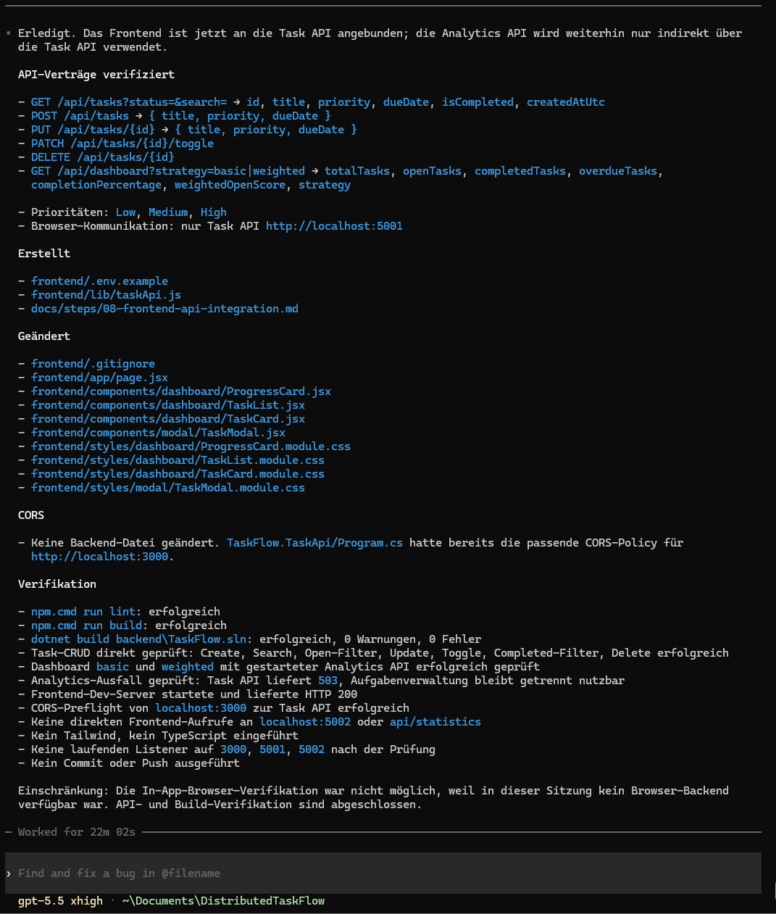

# Schritt 08 – Frontend-API-Integration und End-to-End-Prüfung

## Ziel

In diesem Schritt wurde das zuvor implementierte Next.js-Frontend mit der realen Task API verbunden.

Ziel war es, die lokalen Demonstrationsdaten vollständig aus dem aktiven Anwendungsfluss zu entfernen und durch echte Daten aus der SQLite-Datenbank zu ersetzen.

Zusätzlich sollten folgende Funktionen vollständig integriert werden:

- Aufgaben aus der Task API laden
- Aufgaben erstellen
- Aufgaben bearbeiten
- Aufgaben abschließen oder wieder öffnen
- Aufgaben löschen
- Aufgaben nach Titel durchsuchen
- Aufgaben nach Status filtern
- Basic-Statistiken laden
- Weighted-Statistiken laden
- Ladezustände korrekt beenden
- Fehler sichtbar darstellen
- Statistiken nach einem Dienstausfall erneut laden
- die Aufgabenverwaltung bei Ausfall der Analytics API weiterhin nutzbar halten

Die vollständige Anwendung wurde anschließend mit allen drei laufenden Prozessen im Browser geprüft.

---

## Verwendete Werkzeuge und Technologien

- Codex CLI
- Claude Code
- Next.js
- React
- JavaScript
- JSX
- Native Fetch API
- ASP.NET Core
- SQLite
- HTTP
- JSON
- Browser-Entwicklungswerkzeuge
- PowerShell
- npm
- .NET CLI

Bewusst nicht eingeführt wurden:

- Axios
- TypeScript
- Tailwind CSS
- Redux
- Zustand
- zusätzliche UI-Bibliotheken
- automatisierte Testframeworks

---

## Verwendeter Prompt

Der vollständige Prompt für die Frontend-API-Integration ist im Repository gespeichert:

- [Prompt 08 – Frontend-API-Integration](../prompts/08-codex-frontend-api-integration.md)

Der Prompt definierte unter anderem:

- das Lesen der tatsächlichen Backend-Verträge
- die zentrale Frontend-API-Schicht
- die Verwendung einer konfigurierbaren Task-API-Adresse
- die vollständige CRUD-Integration
- die Integration der Dashboard-Statistiken
- getrennte Lade- und Fehlerzustände
- das Verhalten bei Ausfall der Analytics API
- CORS-Prüfung
- Build-Prüfung
- manuelle End-to-End-Verifikation

---

## Ausgangslage

Vor diesem Schritt war das vollständige responsive Dashboard bereits als Next.js- und React-Anwendung vorhanden.

Implementiert waren unter anderem:

- Dashboard-Layout
- Header
- Sidebar
- Statistik-Karten
- Fortschrittsanzeige
- Aufgaben-Toolbar
- Aufgabenliste
- Aufgaben-Karten
- Add-Task-Modal
- Empty State
- Loading State
- Statistics Error State

Das Frontend verwendete jedoch noch lokale Demonstrationsdaten.

Es existierten noch keine produktiven HTTP-Verbindungen zwischen dem Browser und der Task API.

Die Backend-Anwendung war bereits vollständig vorhanden:

- Task API auf Port `5001`
- Analytics API auf Port `5002`
- SQLite-Persistenz
- Aufgaben-CRUD
- Basic- und Weighted-Statistik
- verteilte Kommunikation zwischen den APIs
- Swagger UI

---

# Verteilte Architektur

Die bestehende Prozessaufteilung wurde beibehalten:

```text
Browser
   |
   | HTTP / JSON
   v
Next.js Frontend
   |
   | HTTP / JSON
   v
Task API
   | \
   |  \--> SQLite
   |
   | HTTP / JSON
   v
Analytics API
```

Lokale Adressen:

| Anwendung | Adresse |
| --- | --- |
| Next.js-Frontend | `http://localhost:3000` |
| Task API | `http://localhost:5001` |
| Analytics API | `http://localhost:5002` |

Der Browser kommuniziert ausschließlich mit:

```text
http://localhost:5001
```

Die Analytics API wird nur von der Task API aufgerufen.

Im Frontend existiert kein direkter Request an:

```text
http://localhost:5002
```

und kein direkter Request an:

```text
/api/statistics
```

---

# Verifizierte API-Verträge

Vor der Implementierung wurden die tatsächlichen API-Verträge direkt aus dem Backend gelesen.

Geprüft wurden:

- `Program.cs`
- Request-Modelle
- Response-Modelle
- Aufgabenmodell
- Analytics-Modelle
- Task Service
- Analytics Client
- Repository
- Statistikstrategien

Die Frontend-Implementierung verwendet dadurch die tatsächlichen Property-Namen und Datenformate des Backends.

---

## Task-Modell

Eine Aufgabenantwort enthält:

| Feld | Typ | Bedeutung |
| --- | --- | --- |
| `id` | Number | Eindeutige Aufgaben-ID |
| `title` | String | Aufgabentitel |
| `priority` | String | `Low`, `Medium` oder `High` |
| `dueDate` | String | Fälligkeitsdatum im Format `YYYY-MM-DD` |
| `isCompleted` | Boolean | Abschlussstatus |
| `createdAtUtc` | String | Erstellungszeitpunkt in UTC |

Beispiel:

```json
{
  "id": 4,
  "title": "Connect frontend to Task API",
  "priority": "High",
  "dueDate": "2026-07-15",
  "isCompleted": false,
  "createdAtUtc": "2026-07-13T10:30:00Z"
}
```

---

## Create- und Update-Request

Für das Erstellen und Bearbeiten einer Aufgabe werden folgende Felder gesendet:

```json
{
  "title": "Connect frontend to Task API",
  "priority": "High",
  "dueDate": "2026-07-15"
}
```

Das Frontend sendet nicht:

- `id`
- `isCompleted`
- `createdAtUtc`

Diese Werte werden von der Task API verwaltet.

---

## Dashboard-Modell

Die Dashboard-Antwort enthält:

| Feld | Bedeutung |
| --- | --- |
| `totalTasks` | Gesamtanzahl der Aufgaben |
| `openTasks` | Anzahl offener Aufgaben |
| `completedTasks` | Anzahl erledigter Aufgaben |
| `overdueTasks` | Anzahl offener und überfälliger Aufgaben |
| `completionPercentage` | Prozentualer Abschlusswert |
| `weightedOpenScore` | Gewichteter Score offener Aufgaben |
| `strategy` | Verwendete Strategie |

Beispiel:

```json
{
  "totalTasks": 10,
  "openTasks": 7,
  "completedTasks": 3,
  "overdueTasks": 2,
  "completionPercentage": 30,
  "weightedOpenScore": 0,
  "strategy": "basic"
}
```

---

# Verwendete Endpunkte

## Aufgabenverwaltung

| Methode | Endpunkt | Verantwortung |
| --- | --- | --- |
| `GET` | `/api/tasks?status=&search=` | Aufgaben laden, filtern und durchsuchen |
| `POST` | `/api/tasks` | Aufgabe erstellen |
| `PUT` | `/api/tasks/{id}` | Aufgabe bearbeiten |
| `PATCH` | `/api/tasks/{id}/toggle` | Abschlussstatus umschalten |
| `DELETE` | `/api/tasks/{id}` | Aufgabe löschen |

## Dashboard

| Methode | Endpunkt | Verantwortung |
| --- | --- | --- |
| `GET` | `/api/dashboard?strategy=basic` | Basic-Statistik laden |
| `GET` | `/api/dashboard?strategy=weighted` | Weighted-Statistik laden |

---

# Durchführung

## 1. Frontend-API-Adresse konfigurieren

Die Task-API-Adresse wurde über eine öffentliche Next.js-Umgebungsvariable konfigurierbar gemacht.

Beispieldatei:

- [`.env.example`](../../frontend/.env.example)

Inhalt:

```env
NEXT_PUBLIC_TASK_API_URL=http://localhost:5001
```

Für die lokale Ausführung wurde zusätzlich folgende Datei verwendet:

```text
frontend/.env.local
```

Lokaler Inhalt:

```env
NEXT_PUBLIC_TASK_API_URL=http://localhost:5001
```

Die Datei `.env.local` ist nur für die lokale Entwicklungsumgebung vorgesehen und wird nicht als reguläre Projektkonfiguration in das Repository aufgenommen.

Falls keine gültige Umgebungsvariable vorhanden ist, verwendet die API-Schicht für die lokale Entwicklung ebenfalls:

```text
http://localhost:5001
```

---

## 2. Zentrale API-Schicht erstellen

Die gesamte Browserkommunikation mit der Task API wurde in einer eigenen Datei gekapselt:

- [`taskApi.js`](../../frontend/lib/taskApi.js)

Dadurch befinden sich die Fetch-Aufrufe nicht verteilt in mehreren React-Komponenten.

Die API-Schicht stellt Funktionen bereit für:

```text
getTasks
createTask
updateTask
toggleTask
deleteTask
getDashboard
```

---

## 3. Basisadresse normalisieren

Die konfigurierte Basisadresse wird vor der Verwendung normalisiert.

Dadurch werden Probleme durch einen abschließenden Slash vermieden.

Beispiel:

```text
http://localhost:5001/
```

wird intern verwendet als:

```text
http://localhost:5001
```

Die Endpunkte können anschließend konsistent ergänzt werden.

---

## 4. Query-Parameter erstellen

Statusfilter und Suche werden als Query-Parameter an die Task API gesendet.

Beispiele:

```text
GET /api/tasks?status=all
GET /api/tasks?status=open
GET /api/tasks?status=completed
GET /api/tasks?status=all&search=SQLite
```

Die Werte werden vor der Verwendung URL-sicher kodiert.

---

## 5. HTTP-Antworten verarbeiten

Die API-Schicht unterscheidet zwischen:

- erfolgreichen JSON-Antworten
- erfolgreichen Antworten ohne Body
- Validierungsfehlern
- nicht gefundenen Aufgaben
- nicht verfügbarer Analytics API
- Netzwerkfehlern
- Zeitüberschreitungen

Für:

```text
DELETE /api/tasks/{id}
```

wird die erfolgreiche `204 No Content`-Antwort verarbeitet, ohne anschließend einen JSON-Body zu erwarten.

---

## 6. Zeitüberschreitung und Request-Abbruch

Für die Fetch-Aufrufe wurde ein kontrollierter Timeout verwendet.

Dadurch können Requests nicht unbegrenzt im Ladezustand verbleiben.

Ein `AbortController` beendet einen Request, wenn das festgelegte Zeitlimit überschritten wird.

Nach Erfolg oder Fehler werden die zugehörigen Ladezustände immer beendet.

---

# Integration in `page.jsx`

Die zentrale Steuerung der Anwendung befindet sich in:

- [`page.jsx`](../../frontend/app/page.jsx)

Die Seite verwaltet unter anderem:

- Aufgaben
- Aufgaben-Ladezustand
- Aufgabenfehler
- Dashboarddaten
- Dashboard-Ladezustand
- Dashboardfehler
- Suchtext
- Statusfilter
- Statistikstrategie
- Modalstatus
- Modalmodus
- ausgewählte Aufgabe
- laufende Mutation
- laufende Toggle- oder Delete-Aktionen

---

## Getrennte Ladezustände

Aufgaben und Dashboard-Statistiken verwenden voneinander unabhängige Ladezustände.

```text
tasksLoading
dashboardLoading
```

Dadurch kann beispielsweise:

- die Aufgabenliste bereits sichtbar sein
- während die Statistik noch geladen wird

oder:

- ein Statistikfehler angezeigt werden
- während die Aufgabenverwaltung weiterhin funktioniert

Jeder asynchrone Ablauf beendet seinen Ladezustand in einem `finally`-Block.

Damit kann ein fehlgeschlagener Request die Anwendung nicht dauerhaft im Skeleton-Zustand halten.

---

## Getrennte Fehlerzustände

Die Anwendung unterscheidet zwischen:

```text
tasksError
dashboardError
mutationError
```

Dadurch blockiert ein Statistikfehler nicht die Aufgabenverwaltung.

Fehler werden erst nach einem erfolgreichen erneuten Request gelöscht.

Eine bestehende Statistikfehlermeldung verschwindet dadurch nicht kurzzeitig während eines noch laufenden und erneut fehlschlagenden Hintergrund-Requests.

---

# Aufgaben laden

Beim Start des Frontends werden Aufgaben über folgenden Endpunkt geladen:

```text
GET /api/tasks
```

Abhängig von Filter und Suche wird die URL ergänzt.

Nach erfolgreicher Antwort:

1. wird die JSON-Antwort gelesen
2. wird geprüft, ob eine Aufgabenliste zurückgegeben wurde
3. werden die Aufgaben im React-State gespeichert
4. wird der Loading State beendet
5. wird die Aufgabenliste gerendert

Wenn keine Aufgaben vorhanden sind, wird der Empty State angezeigt.

---

## Fehler beim Laden der Aufgaben

Wenn das Laden fehlschlägt:

- wird der Skeleton-Zustand beendet
- wird eine sichtbare Fehlermeldung angezeigt
- bleiben andere Bereiche der Anwendung erreichbar
- kann über einen Retry-Button erneut geladen werden

Der Retry für Aufgaben lädt ausschließlich die Aufgaben neu.

---

# Dashboard-Statistiken laden

Die Dashboarddaten werden über die Task API geladen:

```text
GET /api/dashboard?strategy=basic
```

oder:

```text
GET /api/dashboard?strategy=weighted
```

Die Task API lädt intern die Aufgaben aus SQLite und ruft anschließend die Analytics API auf.

Der Browser bleibt von dieser internen Kommunikation getrennt.

---

## Basic-Strategie

Die Basic-Strategie zeigt:

- Gesamtanzahl
- offene Aufgaben
- erledigte Aufgaben
- überfällige Aufgaben
- Abschlussquote

Der Weighted Open Score ist bei dieser Strategie:

```text
0
```

---

## Weighted-Strategie

Bei Auswahl von `weighted` wird folgender Endpunkt verwendet:

```text
GET /api/dashboard?strategy=weighted
```

Zusätzlich zu den Basiswerten wird der gewichtete Score offener Aufgaben dargestellt.

Die Auswahl der Strategie erfolgt über die vorhandene Toolbar.

---

# CRUD-Integration

## Aufgabe erstellen

Beim Speichern im Create-Modus wird gesendet:

```text
POST /api/tasks
```

Request Body:

```json
{
  "title": "New task",
  "priority": "Medium",
  "dueDate": "2026-07-15"
}
```

Nach erfolgreichem Erstellen:

1. wird das Modal geschlossen
2. werden die Aufgaben neu geladen
3. werden die Dashboarddaten neu geladen
4. werden alte Fehlermeldungen entfernt

---

## Aufgabe bearbeiten

Beim Öffnen des Edit-Modus wird die ausgewählte Aufgabe in das Modal übernommen.

Bearbeitbare Felder:

- Titel
- Priorität
- Fälligkeitsdatum

Gesendet wird:

```text
PUT /api/tasks/{id}
```

Der Abschlussstatus wird beim Bearbeiten nicht überschrieben.

Nach Erfolg werden Aufgaben und Dashboard erneut geladen.

---

## Abschlussstatus umschalten

Für das Umschalten wird verwendet:

```text
PATCH /api/tasks/{id}/toggle
```

Der Status wechselt zwischen:

```text
open
completed
```

Während der Request läuft, wird eine doppelte Toggle-Aktion für dieselbe Aufgabe verhindert.

Nach Erfolg werden Aufgaben und Statistiken aktualisiert.

---

## Aufgabe löschen

Für das Löschen wird verwendet:

```text
DELETE /api/tasks/{id}
```

Vor dem Löschen wird eine Bestätigung angefordert.

Wenn der Benutzer abbricht, wird kein Request ausgeführt.

Während eines laufenden Delete-Requests wird eine doppelte Aktion verhindert.

Nach erfolgreichem Löschen werden Aufgaben und Dashboard neu geladen.

---

# Suche und Filter

## Titelsuche

Die Suche befindet sich im Header.

Der Suchtext wird an die Task API gesendet:

```text
GET /api/tasks?status=all&search=<Suchtext>
```

Die Task API übernimmt die fachliche Filterung.

---

## Statusfilter

Unterstützte Filter:

```text
all
open
completed
```

Die Filter werden nicht nur lokal auf bereits geladenen Daten angewendet.

Bei einer Änderung wird eine neue Anfrage an die Task API gesendet.

Beispiele:

```text
GET /api/tasks?status=open
GET /api/tasks?status=completed
```

---

# Task-Modal

Für Create und Edit wird ein gemeinsames Modal verwendet:

- [`TaskModal.jsx`](../../frontend/components/modal/TaskModal.jsx)

Der zentrale Modalstatus wird in `page.jsx` verwaltet.

Verwendete Zustände:

- geöffnet oder geschlossen
- Create- oder Edit-Modus
- ausgewählte Aufgabe
- laufender Submit
- Validierungs- oder API-Fehler

---

## Modal öffnen

Das gemeinsame Modal kann geöffnet werden über:

- Desktop-Button `Add Task`
- mobilen Add-Task-Button
- Create-Task-Aktion im Empty State
- Edit-Aktion einer Task Card

---

## Modal schließen

Das Modal kann geschlossen werden über:

- Close-Icon
- Cancel-Button
- Escape-Taste
- Klick auf das Overlay außerhalb des Dialogs

Ein Klick innerhalb des Dialogs schließt das Modal nicht.

Buttons, die kein Formular absenden, verwenden:

```html
type="button"
```

Dadurch werden unbeabsichtigte Formular-Submits verhindert.

---

## Validierung im Modal

Bei einem ungültigen oder abgelehnten Request:

- bleibt das Modal geöffnet
- wird die Fehlermeldung im Modal angezeigt
- gehen die Eingabewerte nicht verloren
- wird der Submit-Button wieder freigegeben

Doppelte Create- oder Edit-Requests werden während des laufenden Submits verhindert.

---

# Verhalten bei Ausfall der Analytics API

Die Statistikfunktion wurde bewusst von der Aufgabenverwaltung getrennt.

Wenn die Analytics API nicht erreichbar ist, liefert die Task API für den Dashboard-Endpunkt:

```text
HTTP 503 Service Unavailable
```

Verwendete Nachricht:

```text
Statistics are temporarily unavailable. Your tasks can still be managed.
```

Das Frontend zeigt daraufhin die vorhandene Komponente:

- [`StatisticsError.jsx`](../../frontend/components/states/StatisticsError.jsx)

---

## Weiterhin nutzbare Funktionen

Während die Analytics API nicht verfügbar ist, bleiben folgende Funktionen nutzbar:

- Aufgaben laden
- Aufgabe erstellen
- Aufgabe bearbeiten
- Status umschalten
- Aufgabe löschen
- Suche
- All-Filter
- Open-Filter
- Completed-Filter

Nur die Statistikberechnung ist vorübergehend nicht verfügbar.

---

## Retry

Der Statistics Error State enthält einen Retry-Button.

Nach dem Neustart der Analytics API:

1. klickt der Benutzer auf `Retry`
2. nur der Dashboard-Request wird erneut ausgeführt
3. die Statistikdaten werden neu geladen
4. die Fehlermeldung wird nach erfolgreicher Antwort entfernt

Die Aufgabenliste muss dafür nicht neu geladen werden.

---

# CORS-Konfiguration

Die Task API wurde für die lokale Frontend-Kommunikation geprüft und abschließend für mehrere mögliche Entwicklungsadressen konfiguriert.

Unterstützte Origins:

```text
http://localhost:3000
http://127.0.0.1:3000
http://172.27.176.1:3000
```

Unterstützte Methoden:

```text
GET
POST
PUT
PATCH
DELETE
OPTIONS
```

JSON-Request-Header wie:

```text
Content-Type: application/json
```

werden zugelassen.

Die CORS-Middleware wird vor der Ausführung der Endpunkte angewendet.

Die Analytics API benötigt keine Browser-CORS-Regel, weil der Browser sie nicht direkt aufruft.

Zugehörige Datei:

- [`Program.cs`](../../backend/TaskFlow.TaskApi/Program.cs)

---

# Stabiler SQLite-Datenbankpfad

Die Connection String-Konfiguration verwendet weiterhin:

```text
Data Source=taskflow.db
```

Ein relativer SQLite-Pfad kann jedoch abhängig vom Startverzeichnis zu unterschiedlichen Datenbankdateien führen.

Deshalb wurde das SQLite-Repository so angepasst, dass ein relativer Pfad gegen den Content Root der Task API aufgelöst wird.

Zugehörige Datei:

- [`SqliteTaskRepository.cs`](../../backend/TaskFlow.TaskApi/Repositories/SqliteTaskRepository.cs)

Der verifizierte Laufzeitpfad lautet:

```text
C:\Users\Mohamed\Documents\DistributedTaskFlow\backend\TaskFlow.TaskApi\taskflow.db
```

Dadurch verwendet die Task API unabhängig vom PowerShell-Arbeitsverzeichnis dieselbe Datenbankdatei.

Die vorhandene Datenbank wurde nicht gelöscht oder zurückgesetzt.

---

# Root Layout und Browser-Hydration

Das Root Layout wurde für eine stabile Browserdarstellung angepasst:

- [`layout.jsx`](../../frontend/app/layout.jsx)

Dabei wurde die bestehende Next.js-Struktur beibehalten.

Die Änderung verhindert unnötige Hydration-Warnungen durch Attribute, die außerhalb von React beispielsweise durch Browsererweiterungen eingefügt werden können.

Die eigentlichen React-, CORS- und Fetch-Fehler wurden weiterhin separat über Browser-Konsole und Netzwerkansicht geprüft.

---

# Zugehörige Dateien

## Frontend-Konfiguration

- [`.env.example`](../../frontend/.env.example)

Die lokale Datei:

```text
frontend/.env.local
```

wird nur in der Entwicklungsumgebung verwendet und nicht als reguläre Repository-Datei dokumentiert.

---

## App Router und API-Schicht

- [`layout.jsx`](../../frontend/app/layout.jsx)
- [`page.jsx`](../../frontend/app/page.jsx)
- [`taskApi.js`](../../frontend/lib/taskApi.js)

---

## Angepasste Dashboard-Komponenten

- [`ProgressCard.jsx`](../../frontend/components/dashboard/ProgressCard.jsx)
- [`TaskList.jsx`](../../frontend/components/dashboard/TaskList.jsx)
- [`TaskCard.jsx`](../../frontend/components/dashboard/TaskCard.jsx)

---

## Angepasste Modal-Komponente

- [`TaskModal.jsx`](../../frontend/components/modal/TaskModal.jsx)

---

## Angepasste Styles

- [`ProgressCard.module.css`](../../frontend/styles/dashboard/ProgressCard.module.css)
- [`TaskList.module.css`](../../frontend/styles/dashboard/TaskList.module.css)
- [`TaskCard.module.css`](../../frontend/styles/dashboard/TaskCard.module.css)
- [`TaskModal.module.css`](../../frontend/styles/modal/TaskModal.module.css)

---

## Backend-Anpassungen der Integration

- [`Program.cs`](../../backend/TaskFlow.TaskApi/Program.cs)
- [`SqliteTaskRepository.cs`](../../backend/TaskFlow.TaskApi/Repositories/SqliteTaskRepository.cs)

---

# Screenshot

- [Codex CLI – Ergebnis der Frontend-API-Integration öffnen](../screenshots/codex/codex-08-frontend-api-integration-result.png)



Der Screenshot dokumentiert:

- die praktische Verwendung von Codex CLI
- die zentrale API-Integration
- die verbundenen CRUD-Funktionen
- die Dashboard-Integration
- die durchgeführten Build- und HTTP-Prüfungen
- den Abschluss des Integrationsauftrags

---

# Start der vollständigen Anwendung

Für die End-to-End-Prüfung wurden drei Prozesse gestartet.

---

## 1. Analytics API starten

```powershell
dotnet run `
  --project backend\TaskFlow.AnalyticsApi\TaskFlow.AnalyticsApi.csproj `
  --urls "http://localhost:5002"
```

Erreichbar unter:

```text
http://localhost:5002
```

---

## 2. Task API starten

```powershell
dotnet run `
  --project backend\TaskFlow.TaskApi\TaskFlow.TaskApi.csproj `
  --urls "http://localhost:5001"
```

Erreichbar unter:

```text
http://localhost:5001
```

---

## 3. Frontend starten

Aus dem Verzeichnis `frontend/`:

```powershell
npm.cmd run dev
```

Erreichbar unter:

```text
http://localhost:3000
```

Für die reguläre lokale Entwicklung wird die Verwendung von:

```text
http://localhost:3000
```

empfohlen.

---

# HTTP-Verifikation

Vor der Browserprüfung wurden folgende Endpunkte direkt geprüft:

```text
GET http://localhost:5002/
GET http://localhost:5001/
GET http://localhost:5001/api/tasks
GET http://localhost:5001/api/dashboard?strategy=basic
GET http://localhost:5001/api/dashboard?strategy=weighted
```

Alle Endpunkte antworteten im normalen Betriebszustand erfolgreich.

---

## CRUD-Verifikation

Mit einer temporären Aufgabe wurden folgende Operationen geprüft:

1. Aufgabe mit `POST` erstellen
2. erstellte Aufgabe laden
3. Aufgabe mit `PUT` bearbeiten
4. Status mit `PATCH` umschalten
5. Aufgabe mit `DELETE` löschen

Die vorhandenen Benutzerdaten wurden dabei nicht gelöscht.

Nach Abschluss der Prüfung wurden temporär erstellte Testdaten wieder entfernt.

---

# Browser-End-to-End-Prüfung

Die vollständige Anwendung wurde anschließend in einem realen Browser geöffnet:

```text
http://localhost:3000
```

Dabei wurden Browser-DOM, Netzwerkrequests und Konsole geprüft.

---

## Initiales Laden

Verifiziert wurde:

- Frontend-Dokument lädt
- `GET /api/tasks` wird an Port `5001` gesendet
- Task-Request liefert `HTTP 200`
- Dashboard-Request wird an Port `5001` gesendet
- Dashboard-Request liefert `HTTP 200`
- Loading State wird beendet
- reale Aufgaben werden angezeigt
- reale Statistiken werden angezeigt
- keine direkte Anfrage an Port `5002` wird gesendet

---

## Verifizierte Aufgabenfunktionen

Im Browser wurden erfolgreich geprüft:

- Aufgabe erstellen
- Aufgabe bearbeiten
- Aufgabe abschließen
- Aufgabe wieder öffnen
- Aufgabe löschen
- Löschen abbrechen
- Aufgaben suchen
- All-Filter
- Open-Filter
- Completed-Filter

Nach jeder Mutation wurden Aufgaben und Dashboarddaten aktualisiert.

---

## Verifiziertes Modalverhalten

Geprüft wurden:

- Desktop-Add-Task-Button öffnet das Modal
- Create-Modus zeigt leere Felder
- Edit-Modus zeigt vorhandene Aufgabendaten
- Cancel schließt das Modal
- Close-Icon schließt das Modal
- Escape schließt das Modal
- Overlay-Klick schließt das Modal
- Klick innerhalb des Dialogs schließt das Modal nicht
- erfolgreiche Speicherung schließt das Modal
- Eingabedatum verwendet `YYYY-MM-DD`

---

## Verifizierte Dashboardfunktionen

Geprüft wurden:

- Basic-Strategie
- Weighted-Strategie
- Total Tasks
- Open Tasks
- Completed Tasks
- Overdue Tasks
- Completion Percentage
- Weighted Open Score

Die angezeigten Werte wurden mit den direkten API-Antworten verglichen.

---

## Prüfung des Analytics-Ausfalls

Während Frontend und Task API weiterliefen, wurde die Analytics API gestoppt.

Anschließend wurde geprüft:

- Task API Dashboard-Endpunkt liefert `HTTP 503`
- Statistics Error State wird angezeigt
- Aufgaben bleiben sichtbar
- Aufgabenverwaltung bleibt nutzbar
- Toggle funktioniert weiterhin
- Browser sendet weiterhin keine Anfrage an Port `5002`

Nach dem Neustart der Analytics API wurde der Retry-Button verwendet.

Ergebnis:

- Statistikdaten wurden erneut geladen
- Error State wurde entfernt
- Aufgabenliste blieb unverändert nutzbar

---

## Browser-Konsole

Geprüft wurde auf:

- CORS-Fehler
- Fetch-Fehler
- React-Fehler
- Hydration-Fehler
- nicht behandelte Promise-Fehler
- JavaScript-Runtime-Fehler

Im normalen Betriebszustand wurden keine blockierenden Frontendfehler festgestellt.

Während des bewusst simulierten Analytics-Ausfalls wurde der erwartete `503`-Fehler kontrolliert verarbeitet und im Statistics Error State dargestellt.

---

## Netzwerkgrenze

Während der gesamten Browserprüfung wurde bestätigt:

```text
Browser → Task API auf Port 5001
```

Es wurde kein direkter Browserrequest gefunden für:

```text
localhost:5002
```

oder:

```text
/api/statistics
```

Damit bleibt die geplante verteilte Architektur eingehalten.

---

# Build-Prüfung

## Frontend-Lint

Ausgeführt im Verzeichnis:

```text
frontend/
```

Befehl:

```powershell
npm.cmd run lint
```

Ergebnis:

```text
erfolgreich
```

---

## Frontend-Production-Build

Befehl:

```powershell
npm.cmd run build
```

Ergebnis:

```text
erfolgreich
```

Bestätigt wurden:

- gültige Next.js-Struktur
- gültige React-Komponenten
- gültige API-Schicht
- auflösbare Imports
- auflösbare CSS Modules
- produktionsfähige Kompilierung

---

## Backend-Build

Ausgeführt im Verzeichnis:

```text
backend/
```

Befehl:

```powershell
dotnet build TaskFlow.sln
```

Ergebnis:

```text
0 Warnung(en)
0 Fehler
```

---

# Zusammenfassung der Verifikation

| Prüfung | Ergebnis |
| --- | --- |
| Task API Root-Endpunkt | erfolgreich |
| Analytics API Root-Endpunkt | erfolgreich |
| Aufgaben laden | erfolgreich |
| Basic-Dashboard | erfolgreich |
| Weighted-Dashboard | erfolgreich |
| Create | erfolgreich |
| Edit | erfolgreich |
| Toggle | erfolgreich |
| Delete | erfolgreich |
| Suche | erfolgreich |
| All-Filter | erfolgreich |
| Open-Filter | erfolgreich |
| Completed-Filter | erfolgreich |
| Add-Task-Modal | erfolgreich |
| Modal schließen | erfolgreich |
| Analytics-Ausfall | korrekt behandelt |
| Retry nach Neustart | erfolgreich |
| Direkter Browserzugriff auf Port 5002 | nicht vorhanden |
| CORS-Preflight | erfolgreich |
| Frontend-Lint | erfolgreich |
| Frontend-Build | erfolgreich |
| Backend-Build | 0 Warnungen, 0 Fehler |

---

# Nicht Bestandteil dieses Schritts

Nicht ergänzt wurden:

- TypeScript
- Tailwind CSS
- externe UI-Bibliotheken
- zusätzliche State-Management-Bibliotheken
- direkter Frontendzugriff auf die Analytics API
- neue Backend-Projekte
- Änderungen an den Google-Stitch-Quelldateien
- Neugestaltung des vorhandenen UI-Designs

Die vorhandene Stitch-basierte Benutzeroberfläche wurde beibehalten.

---

# Ergebnis

Am Ende dieses Schritts war DistributedTaskFlow vollständig integriert und End-to-End funktionsfähig.

Umgesetzt und geprüft wurden:

- zentrale Frontend-API-Schicht
- konfigurierbare Task-API-Adresse
- Laden realer SQLite-Aufgaben
- vollständiges Aufgaben-CRUD
- Suche
- Statusfilter
- Basic-Strategie
- Weighted-Strategie
- getrennte Ladezustände
- getrennte Fehlerzustände
- Retry-Funktionen
- Create- und Edit-Modal
- kontrollierter Analytics-Ausfall
- stabile SQLite-Datenbankposition
- lokale CORS-Konfiguration
- vollständige Browserprüfung
- Frontend-Lint
- Frontend-Production-Build
- Backend-Build

Die statischen Demonstrationsdaten wurden aus dem aktiven Datenfluss entfernt.

Der Browser kommuniziert ausschließlich mit der Task API auf Port `5001`.

Die Task API übernimmt weiterhin die verteilte Kommunikation mit der Analytics API auf Port `5002`.

Abschließendes Build-Ergebnis:

```text
Frontend lint: erfolgreich
Frontend build: erfolgreich
Backend build: 0 Warnung(en), 0 Fehler
```

Damit war die vollständige Implementierung von DistributedTaskFlow abgeschlossen.