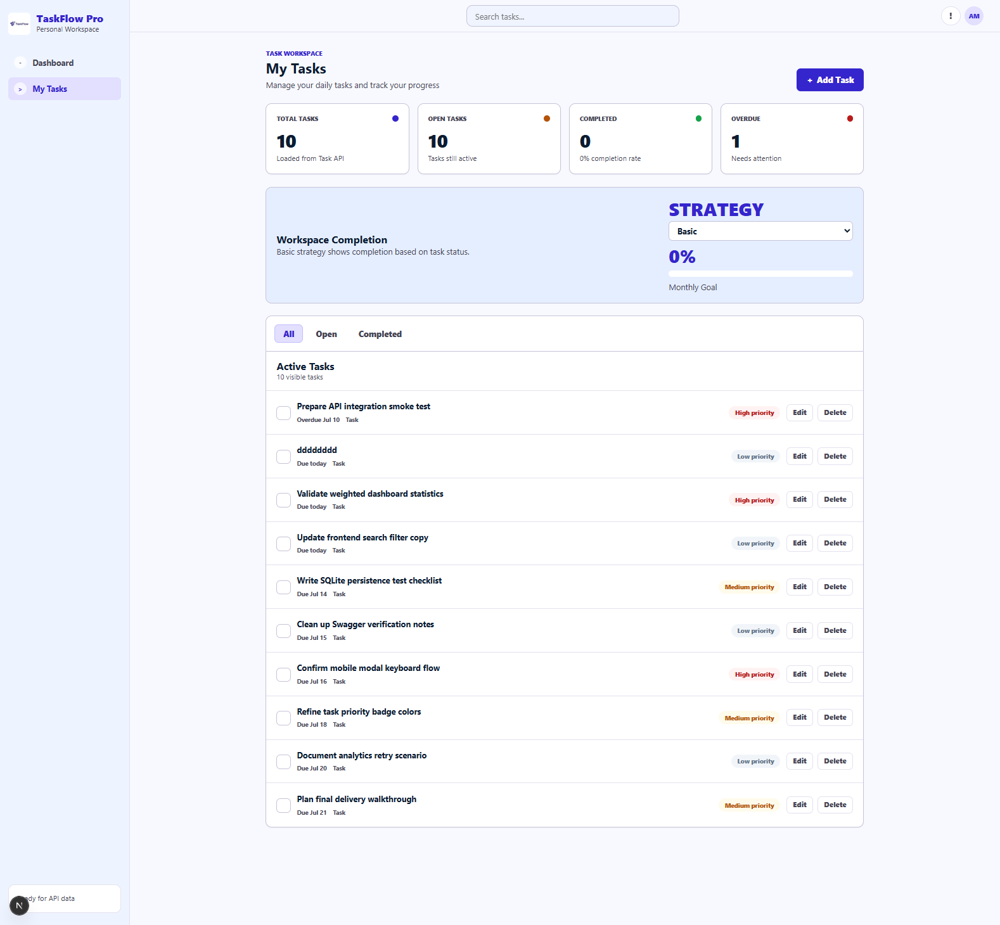
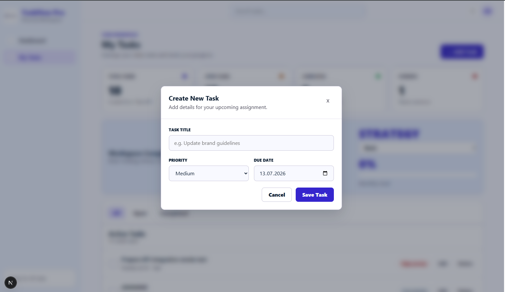

# Finale Browser-Screenshots

Die folgenden Screenshots dokumentieren den funktionsfähigen Endzustand der vollständig integrierten Anwendung.

## Geladenes Dashboard mit realen API-Daten

- [Finales Dashboard öffnen](../screenshots/final/final-02-loaded-dashboard.png)

Der Screenshot dokumentiert:

- das vollständig geladene Dashboard
- zehn aus der Task API geladene Aufgaben
- reale Statistikwerte
- den aktiven Statusfilter `All`
- die Basic-Strategie
- die Abschlussquote
- Prioritätskennzeichnungen
- Edit- und Delete-Aktionen
- die Verbindung zwischen Frontend, Task API und SQLite
- den beendeten Loading State

Die Aufgaben und Statistikwerte werden nicht aus statischen Demonstrationsdaten geladen, sondern über die reale Backend-Integration bereitgestellt.

---

## Geöffnetes Create-Task-Modal

- [Create-Task-Modal öffnen](../screenshots/final/final-01-create-task-modal.png)

Der Screenshot dokumentiert:

- das über dem Dashboard geöffnete Modal
- den Create-Modus
- das Eingabefeld für den Aufgabentitel
- die Prioritätsauswahl
- das Fälligkeitsdatum
- den Cancel-Button
- den Save-Task-Button
- das Modal-Overlay
- die weiterhin sichtbare Dashboard-Anwendung im Hintergrund

Das Modal wird über die zentrale React-State-Steuerung geöffnet und sendet beim Speichern einen realen `POST /api/tasks`-Request an die Task API.

---

## Ergebnis der visuellen Endprüfung

Die finalen Screenshots bestätigen, dass:

- reale Aufgaben geladen werden
- reale Dashboard-Statistiken angezeigt werden
- der Loading State korrekt beendet wird
- das Dashboard vollständig gerendert wird
- das Add-Task-Modal geöffnet werden kann
- die Create-Task-Eingaben verfügbar sind
- das ursprüngliche Google-Stitch-Design erfolgreich in React umgesetzt wurde
- die Frontend-API-Integration im Browser funktionsfähig ist